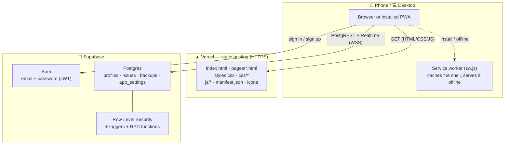
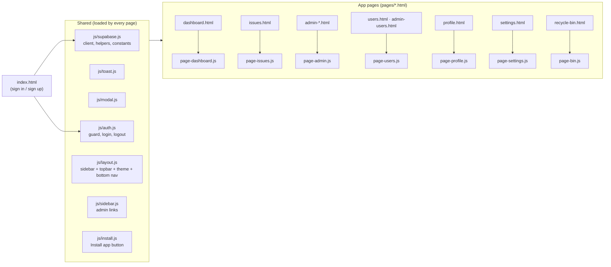
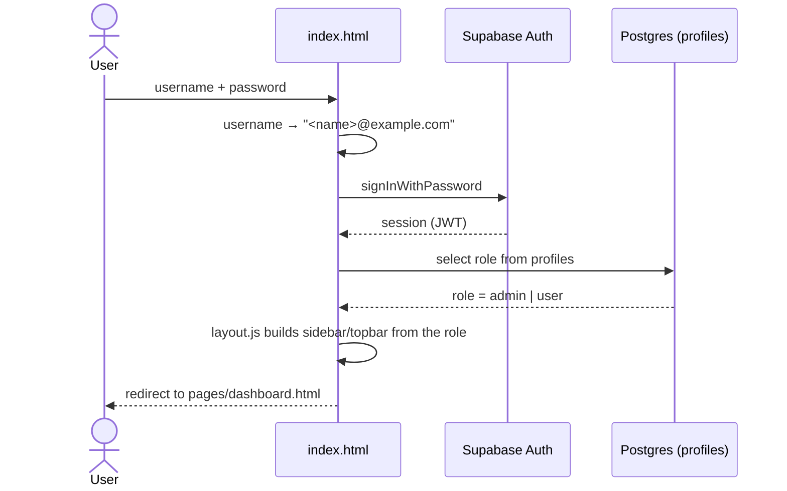
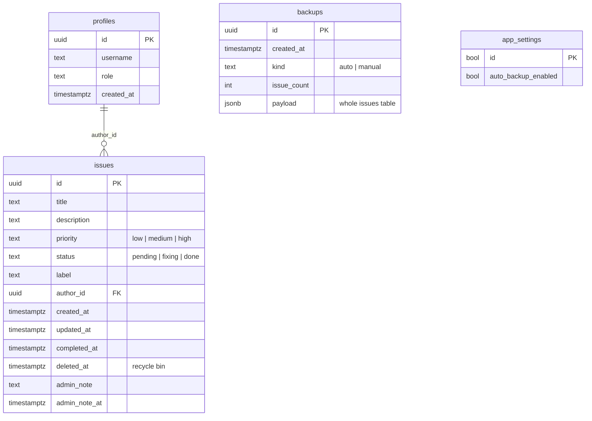
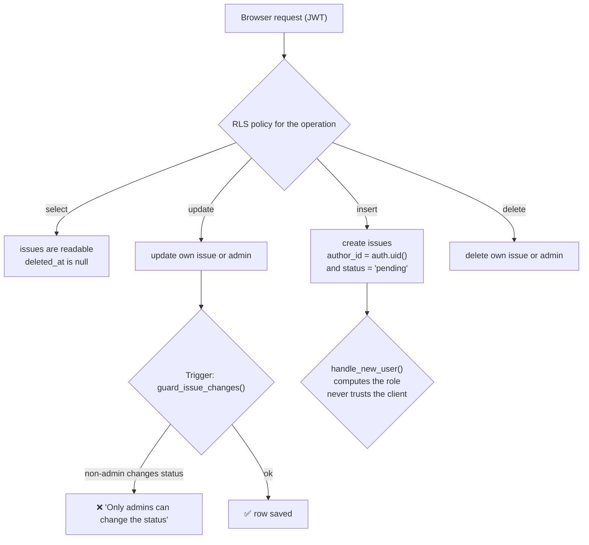
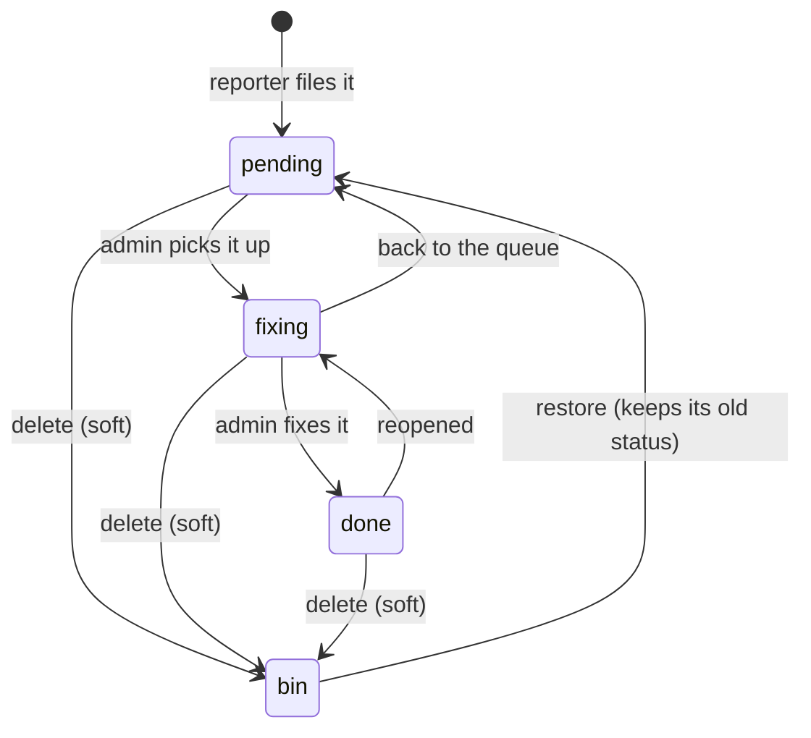
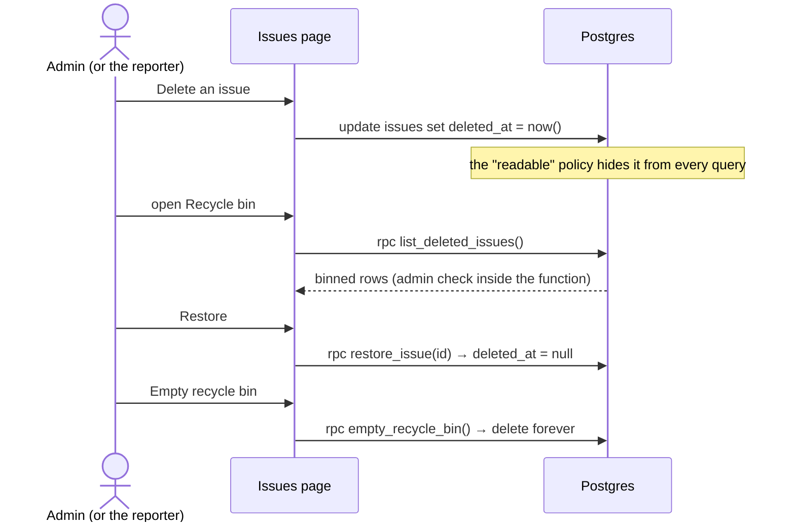
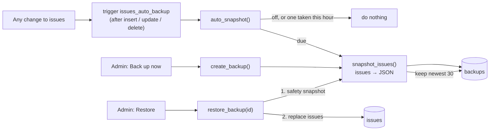
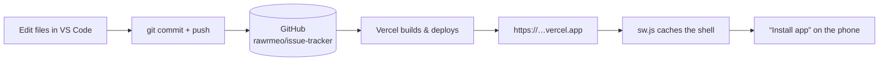
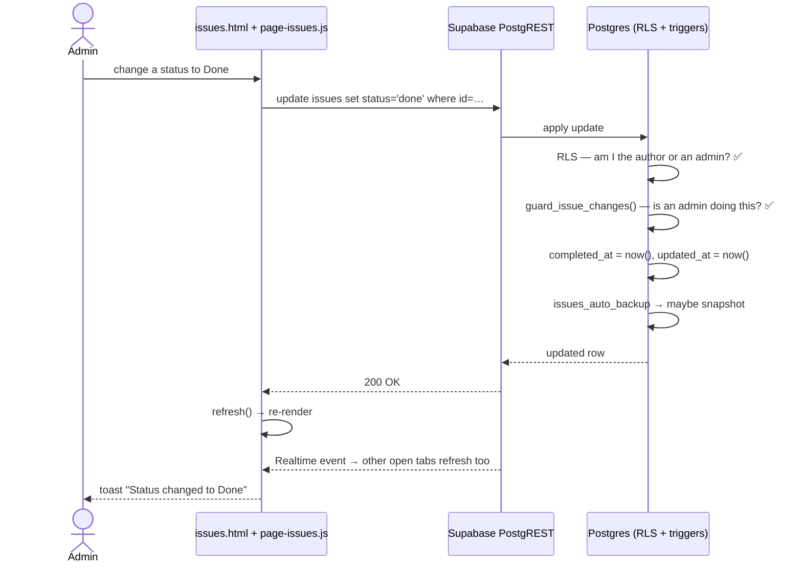

# Architecture & Process Flow

A guide to how the Issue Tracker is put together and how a request moves through
it. The diagrams are [Mermaid](https://mermaid.js.org/) and render directly on
GitHub.

> Taking the project over? Start with **[`HANDOVER.md`](HANDOVER.md)** — it has
> the abstract, a file-by-file repo map, and every left-panel screen walked
> through one by one.

---

## 1. System architecture (the big picture)

The app has **no server of its own**. The browser is the whole front end, and
Supabase is the whole back end.

| Layer | Technology | Notes |
|---|---|---|
| Front end | Plain HTML + CSS + vanilla JS | No build step |
| Hosting | Vercel | Static files, HTTPS, `vercel.json` headers |
| Database | Supabase Postgres | Reached directly from the browser |
| Auth | Supabase Auth | Password login, JWT session |
| API | PostgREST (auto-generated) | `sb.from('issues')…` |
| Live updates | Supabase Realtime | WebSocket on the `issues` table |
| Security | RLS + DB triggers + RPC | Enforced **in the database**, not the UI |

> **Why the anon key is safe:** it is published in `supabase-config.js` on
> purpose. Row Level Security decides what any request may do, so the key
> grants nothing by itself.

---

## 2. Page and module map

Every page loads the same shared modules, then its own page script.

| Page(s) | Purpose | Page script |
|---|---|---|
| `index.html` | Sign in / create account | `auth.js` |
| `pages/dashboard.html` | Stats, chart, repeated issues, activity | `page-dashboard.js` |
| `pages/issues.html` | The board: report, filter, edit, bulk actions | `page-issues.js` |
| `pages/admin-*.html` | Status-focused views (reported / pending / fixing / done / all) | `page-admin.js` |
| `pages/users.html`, `pages/admin-users.html` | Manage accounts | `page-users.js` |
| `pages/profile.html` | Own name / password | `page-profile.js` |
| `pages/settings.html` | Appearance, filters, backups | `page-settings.js` |
| `pages/recycle-bin.html` | Restore or empty deleted issues | `page-bin.js` |

---

## 3. Sign-in flow

Every app page then calls `ET.auth.guard()` first. No session → straight back to
the sign-in page. Admin-only pages (`users`, `recycle-bin`) send non-admins to
the dashboard.

---

## 4. Data model

---

## 5. Security flow (defence in depth)

Two independent layers: **Row Level Security** decides *which rows*, and
**triggers** decide *which columns*.

- **`is_admin()`** is `SECURITY DEFINER`, so policies can check the role without
  recursing back into RLS.
- Even a hand-crafted API call from the browser cannot do more than the buttons
  allow — the database is the final authority.

---

## 6. Issue lifecycle

Deleting never removes the row — it sets `deleted_at`. `List`, the dashboard,
the counts and the realtime feed all stop seeing it.

---

## 7. Recycle bin flow

All three functions re-check `is_admin()` **inside the database**, so the UI is
convenience, not the gate.

---

## 8. Automatic backups

A restore is itself undoable, because the first thing it does is take another
snapshot.

---

## 9. Deployment & install flow

- The repo has an auto-push hook, so a commit also lands on GitHub.
- `vercel.json` adds clean URLs and security headers.
- `sw.js` is network-first, so you always get the newest version, with the
  cached copy as an offline fallback.

---

## 10. One typical request, end to end

---

## Quick reference

| Concern | Where it lives |
|---|---|
| Entry point | `index.html` → `pages/dashboard.html` |
| Data access | `js/supabase.js` (one client for every page) |
| Permissions | `supabase/schema.sql` — RLS policies + `guard_issue_changes()` |
| Admin-only RPCs | `sql/recycle_bin.sql`, `sql/backups.sql` |
| Appearance | `js/layout.js` + `styles.css` (`prefers-color-scheme`) |
| Offline / install | `sw.js` + `manifest.json` + `js/install.js` |
