# Architecture & Process Flow

A guide to how the Issue Tracker is put together and how a request moves through
it. The diagrams are [Mermaid](https://mermaid.js.org/) and render directly on
GitHub, or open **`flowcharts.html`** to see every one on a single page.

> Taking the project over? Start with **[`HANDOVER.md`](HANDOVER.md)** — it has
> the abstract, a file-by-file repo map, and every left-panel screen walked
> through one by one.

---

## 1. System architecture (the big picture)

The app has **no server of its own**. The browser is the whole front end, and
Supabase is the whole back end.

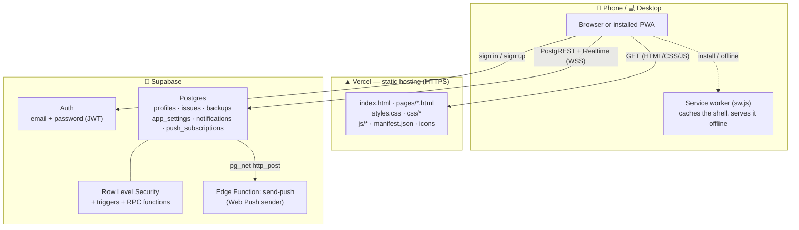

| Layer | Technology | Notes |
|---|---|---|
| Front end | Plain HTML + CSS + vanilla JS | No build step |
| Hosting | Vercel | Static files, HTTPS, `vercel.json` headers |
| Database | Supabase Postgres | Reached directly from the browser |
| Auth | Supabase Auth | Password login, JWT session |
| API | PostgREST (auto-generated) | `sb.from('issues')…` |
| Live updates | Supabase Realtime | WebSocket on `issues`, `profiles`, `notifications` |
| Notifications | Triggers + `pg_net` + Edge Function | In-app bell + optional Web Push |
| Security | RLS + DB triggers + RPC | Enforced **in the database**, not the UI |

> **Why the anon key is safe:** it is published in `supabase-config.js` on
> purpose. Row Level Security decides what any request may do, so the key
> grants nothing by itself.

---

## 2. Runtime topology — one round trip

There is no application server in the middle. The browser holds a JWT and talks
straight to PostgREST; Postgres applies the policies and triggers.

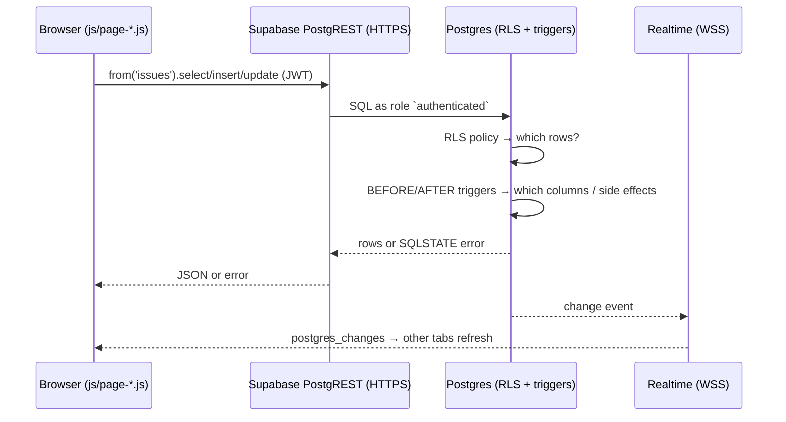

---

## 3. Page and module map

Every page loads the same shared modules, then its own page script.

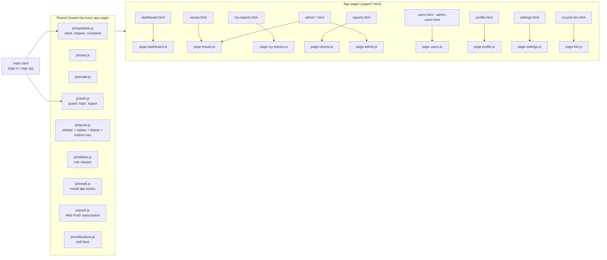

| Page(s) | Purpose | Page script |
|---|---|---|
| `index.html` | Sign in / create account | `auth.js` |
| `pages/dashboard.html` | Stats, chart, repeated issues, activity | `page-dashboard.js` |
| `pages/issues.html` | The board: report, filter, edit, bulk actions | `page-issues.js` |
| `pages/my-reports.html` | Your own reports + admin messages | `page-my-reports.js` |
| `pages/reports.html` | Admin: date-filtered list + CSV/JSON/print export | `page-reports.js` |
| `pages/admin-*.html` | Legacy status-focused views (URL only) | `page-issues.js` + `page-admin.js` |
| `pages/users.html`, `pages/admin-users.html` | Manage accounts | `page-users.js` |
| `pages/profile.html` | Own name / password | `page-profile.js` |
| `pages/settings.html` | Appearance, filters, push, backups | `page-settings.js` |
| `pages/recycle-bin.html` | Archive: restore or empty deleted issues | `page-bin.js` |

---

## 4. Sign-in and session flow

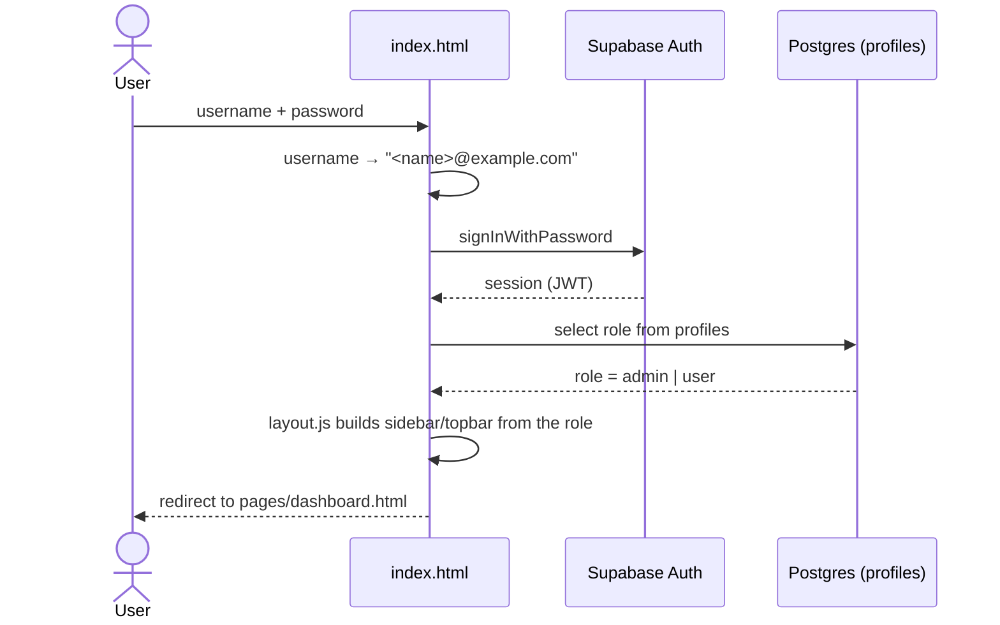

Every app page then calls `ET.layout.render()`, which first runs
`ET.auth.guard()`. No session → straight back to the sign-in page. Admin-only
pages (`users`, `reports`, `archive`) send non-admins to the dashboard.

---

## 5. Data model

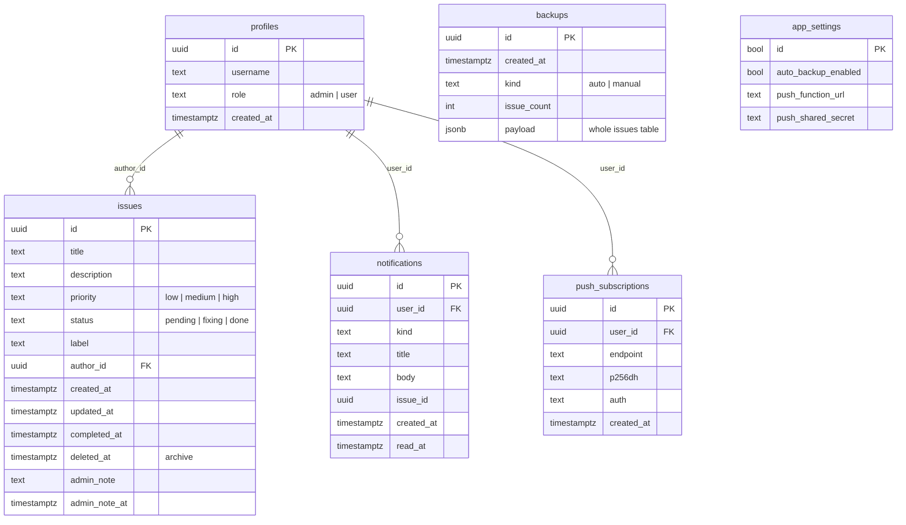

**Users live in two places, on purpose:** Supabase's built-in `auth.users`
(credentials) and `public.profiles` (username + role). A trigger copies a row
across when someone signs up.

---

## 6. Security model (defence in depth)

Two independent layers: **Row Level Security** decides *which rows*, and
**triggers** decide *which columns* and drive side effects.

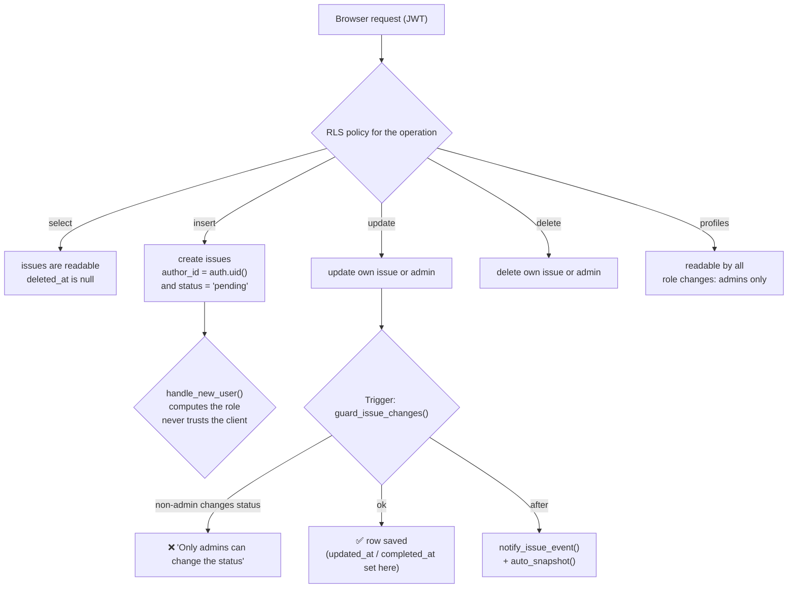

- **`is_admin()`** is `SECURITY DEFINER`, so policies can check the role without
  recursing back into RLS.
- Even a hand-crafted API call from the browser cannot do more than the buttons
  allow — the database is the final authority.
- **Admin-only actions** (archive, backups) go through `SECURITY DEFINER`
  functions that re-check `is_admin()` **inside the database**.

---

## 7. Issue lifecycle

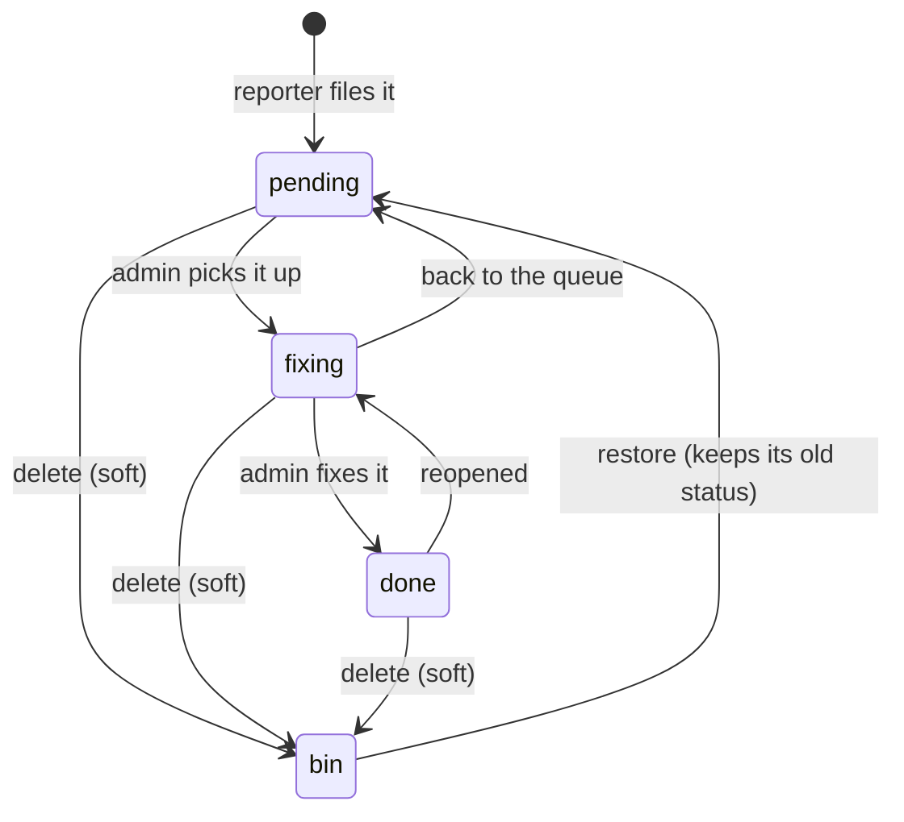

Deleting never removes the row — it sets `deleted_at`. The list, the dashboard,
the counts and the realtime feed all stop seeing it.

---

## 8. Archive flow

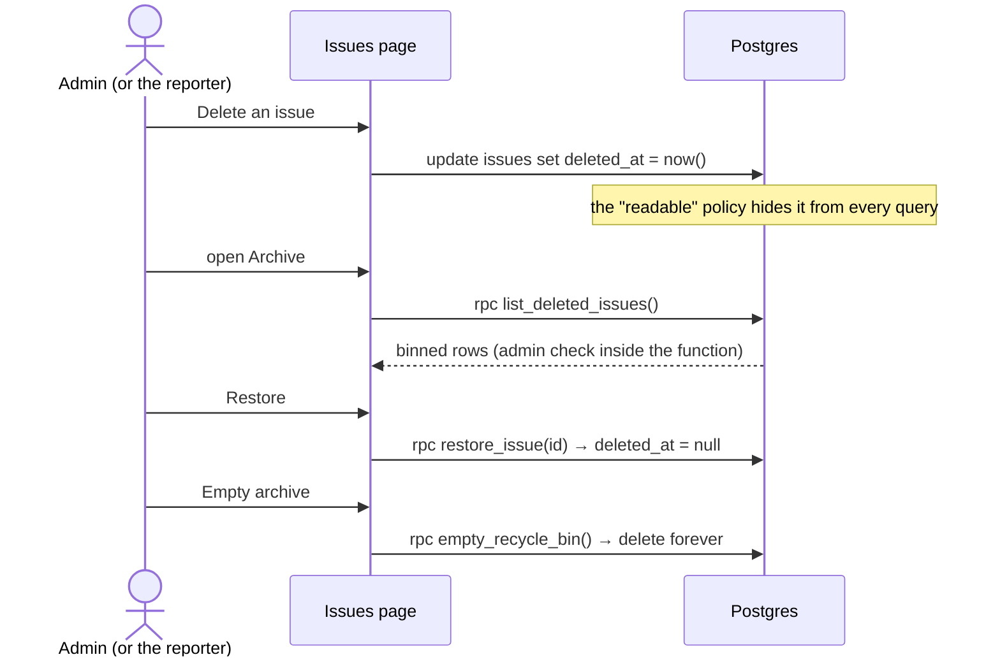

All three functions re-check `is_admin()` **inside the database**, so the UI is
convenience, not the gate.

---

## 9. Notifications (bell + push) flow

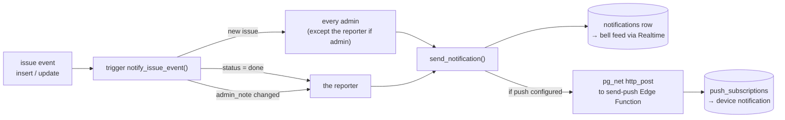

The bell in the top bar reads the newest 30 rows for the signed-in user and
updates over Realtime. Push is optional: until the VAPID key and Edge Function
are configured, `send_notification()` still writes the in-app row and the bell
stays useful.

---

## 10. Automatic backups

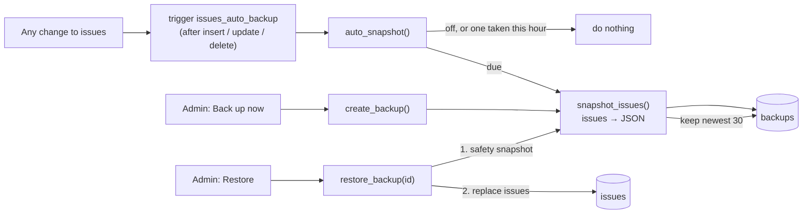

A restore is itself undoable, because the first thing it does is take another
snapshot.

---

## 11. Deployment & install flow

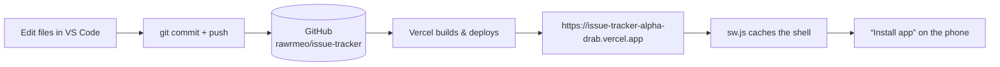

- The `develop` branch auto-pushes, so a commit also lands on GitHub; merging
  into `main` is what triggers the production deploy.
- `vercel.json` adds clean URLs and security headers.
- `sw.js` is network-first, so you always get the newest version, with the
  cached copy as an offline fallback.

---

## 12. One typical request, end to end

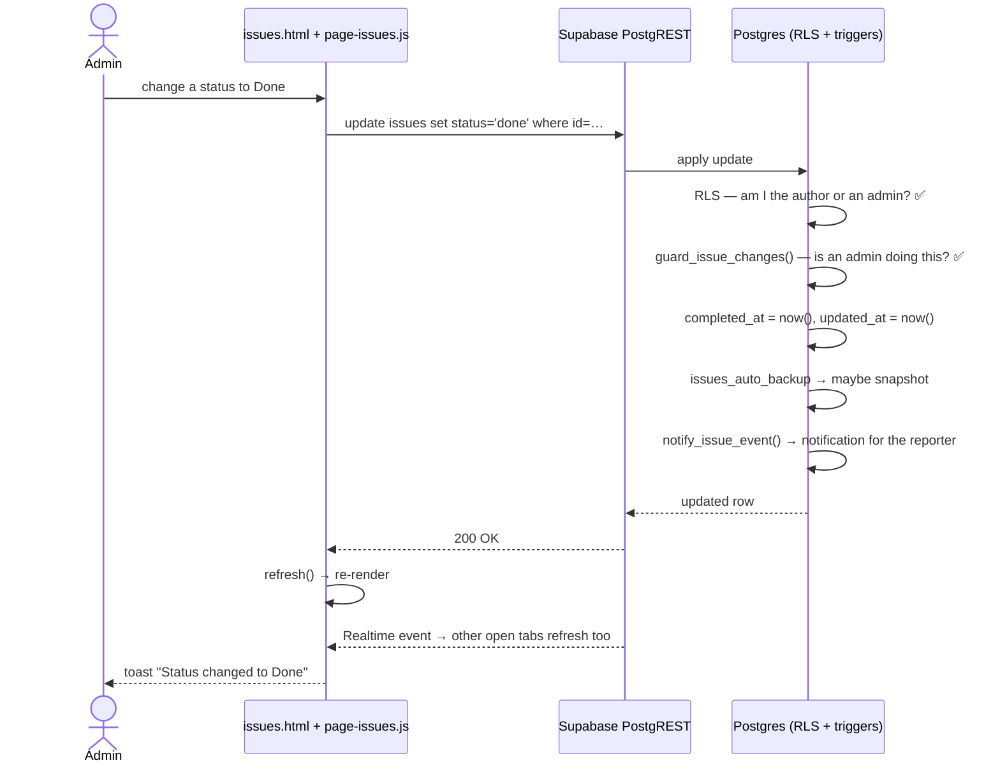

---

## 13. Process flow — the PDCE cycle

The app exists to run a **continuous improvement loop**, so its day-to-day
process is best read as **Plan → Do → Check → Evaluate**.

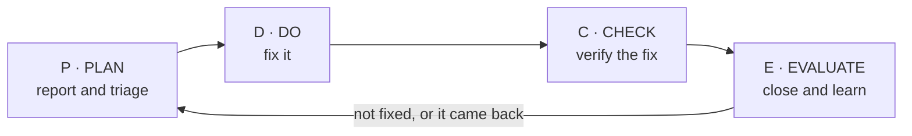

### 13.1 The loop, mapped onto the app

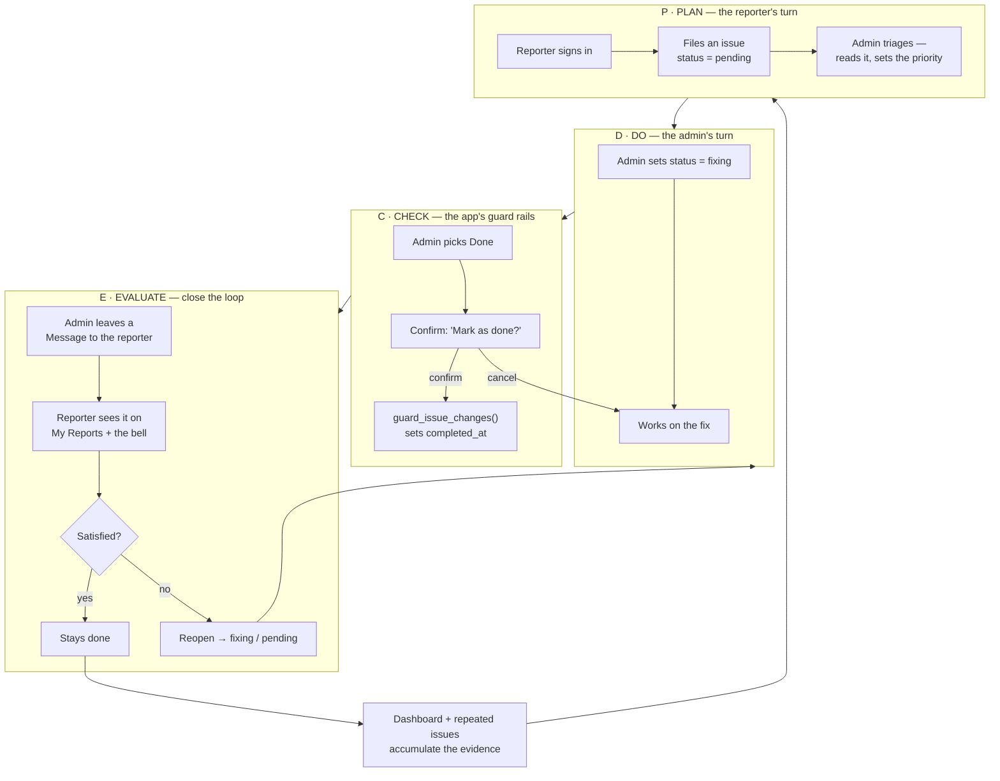

### 13.2 Where each phase actually lives

| Phase | Who | In the app | In the database |
|---|---|---|---|
| **P · Plan** | Reporter | `pages/issues.html` → report form | `insert into issues`, `status = 'pending'` |
| **D · Do** | Admin | Status dropdown → **Fixing** | `update status` — RLS + trigger allow admins only |
| **C · Check** | Admin | Confirm dialog before **Done** | `guard_issue_changes()` sets `completed_at` |
| **E · Evaluate** | Admin + Reporter | **Message to the reporter**; My Reports; repeated-issues list spots a regression | `admin_note`; `notify_issue_event()` tells the reporter |

**Why the loop is real, not just a label:** every phase writes to the same
`issues` row, and the Dashboard + *Most repeated issues* card feed the evidence
straight back into the next round of planning.

### 13.3 The same cycle for the maintainer

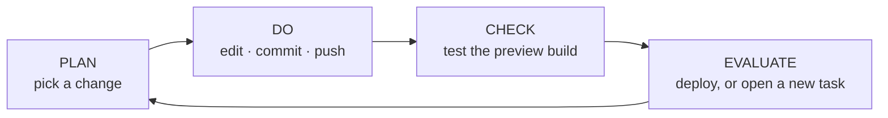

---

## Quick reference

| Concern | Where it lives |
|---|---|
| Entry point | `index.html` → `pages/dashboard.html` |
| Data access | `js/supabase.js` (one client for every page) |
| Permissions | `supabase/schema.sql` — RLS policies + `guard_issue_changes()` |
| Admin-only RPCs | `sql/recycle_bin.sql`, `sql/backups.sql` |
| Notifications | `sql/notifications.sql` + `js/notifications.js` + `js/push.js` |
| Push sender | `supabase/functions/send-push/index.ts` |
| Appearance | `js/layout.js` + `styles.css` (`prefers-color-scheme`) |
| Offline / install | `sw.js` + `manifest.json` + `js/install.js` |
| All diagrams | `flowcharts.html` (generated from this file + `HANDOVER.md`) |
