# Handover & Architecture Guide

> **Read this first.** Everything a new maintainer needs to understand, run and
> extend this project. Diagrams are [Mermaid](https://mermaid.js.org/) and render
> on GitHub — or open **`flowcharts.html`** to see every one on a single page.

---

## 0. Abstract

**What it is.** A **multiuser issue tracker** that runs entirely in the browser.
There is no server of your own: the pages are static files hosted on Vercel, and
all data, login and access rules live in **Supabase** (hosted Postgres + Auth).
The app is live at <https://issue-tracker-alpha-drab.vercel.app>.

**Who uses it.**

| Role | Can do |
|---|---|
| **User** (reporter) | Sign in, report issues, search the board, edit/delete their **own** issues, track them on **My Reports**, get notified, change their password |
| **Admin** | Everything above, plus set **status** (pending → fixing → done), manage users, use bulk actions, run **date reports / exports**, restore from the **Archive**, and run **backups** |

**The one rule that shapes everything:** only an **admin** may move an issue
through its statuses. That rule is enforced **in the database** (Row Level
Security + a trigger), not just hidden in the UI — so a hand-crafted API call
cannot bypass it.

**In one picture:**

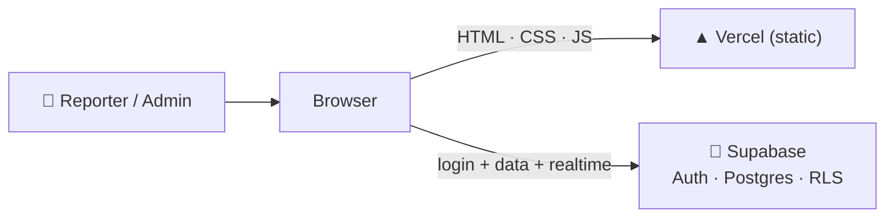

**Why it is built this way.** A single static front end means no server to run or
patch. Putting the rules in Postgres means the security travels with the data.

---

## 1. Technology

| Layer | Choice | Why |
|---|---|---|
| Markup / style | Plain HTML, CSS, vanilla JS | No build step — open a file and it runs |
| Hosting | **Vercel** (static) | Free, HTTPS, instant deploys |
| Database | **Supabase Postgres** | Relational data + one place for rules |
| Auth | **Supabase Auth** | Password login, JWT sessions |
| API | **PostgREST** (auto) | `sb.from('issues')…` talks to tables directly |
| Live updates | **Supabase Realtime** | WebSocket; boards update without refresh |
| Notifications | DB triggers + `pg_net` + Edge Function | In-app bell, plus optional Web Push |
| Offline / install | **Service worker + manifest** | Home-screen app on a phone |
| Charts | Chart.js (CDN) | Dashboard graph |
| Diagrams | Mermaid (CDN) | `flowcharts.html` |

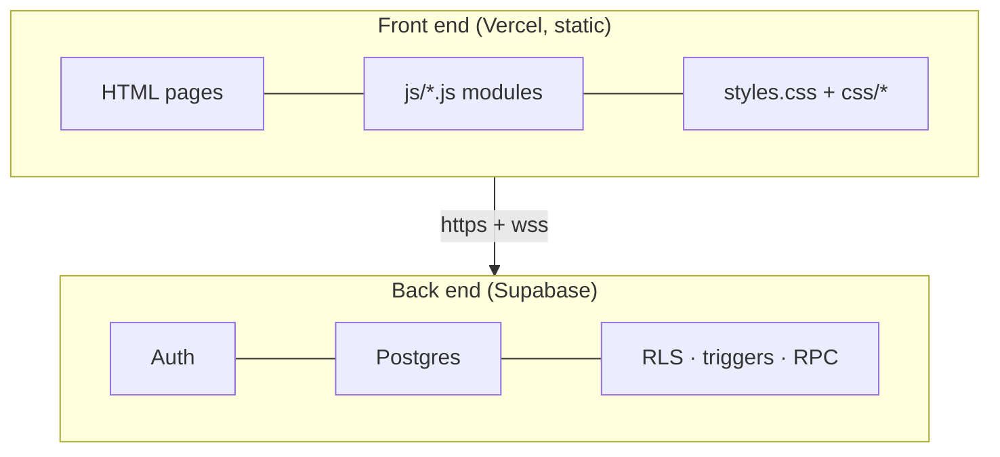

---

## 2. Repository map

Every file, and what it is for. **This is the map to read when you take over.**

### Root

| File | Purpose |
|---|---|
| `index.html` | **Entry point** — sign in / create account. Redirects into `pages/` once signed in. |
| `app.html` / `app.js` | Legacy single-page shell, not part of the current flow |
| `styles.css` | Global design tokens (`--accent`, dark theme) and base components |
| `enhancements.css` / `enhancements.js` | Extra polish (date filter bar etc.) loaded on the Issues page |
| `supabase-config.js` | **Your** Supabase URL + anon key (public by design) + VAPID public key |
| `manifest.json`, `sw.js`, `icon-*.png`, `apple-touch-icon.png`, `logo.svg` | Make it installable (`js/install.js` uses them) |
| `vercel.json` | Clean URLs + security headers |
| `.vercelignore` | Keeps `.env*` and other local files out of deploys |
| `deploy.ps1` | Windows helper: commit + push in one command |
| `README.md`, `SETUP.md`, `ARCHITECTURE.md`, `HANDOVER.md` | Docs |
| `flowcharts.html` | Every diagram from `ARCHITECTURE.md` + `HANDOVER.md`, on one page |
| `tools/build-flowcharts.ps1` | Regenerates `flowcharts.html` from the two markdown files |
| `supabase/schema.sql` | **The whole database** — tables, policies, triggers, functions |
| `sql/*.sql` | Focused migrations; `sql/APPLY-ALL.sql` is all of them in one paste |

### `pages/` — the app screens

| Page | Purpose | Script |
|---|---|---|
| `dashboard.html` | Overview: stats, chart, repeated issues, activity | `page-dashboard.js` |
| `issues.html` | The board (report, filter, edit, bulk) | `page-issues.js` |
| `my-reports.html` | Your own reports, including fixed ones and admin messages | `page-my-reports.js` |
| `reports.html` | Admin: date filter + CSV/JSON/print export | `page-reports.js` |
| `users.html`, `admin-users.html` | Manage accounts | `page-users.js` |
| `profile.html` | Own details + password | `page-profile.js` |
| `settings.html` | Appearance, filters, notifications, backups | `page-settings.js` |
| `recycle-bin.html` | Archive: restore / empty deleted issues | `page-bin.js` |
| `admin-all.html` | All issues (legacy URL-only view) | `page-issues.js` + `page-admin.js` |
| `admin-reported.html` | Reported (status filter = pending) | `page-issues.js` + `page-admin.js` |
| `admin-pending.html` | Pending | `page-issues.js` + `page-admin.js` |
| `admin-fixing.html` | Fixing | `page-issues.js` + `page-admin.js` |
| `admin-done.html` | Done | `page-issues.js` + `page-admin.js` |

### `js/` — the code

| Module | Loaded by | Responsibility |
|---|---|---|
| `supabase.js` | every page | Creates the **one** client, plus helpers (`escapeHtml`, `formatDate`, `timeAgo`, `friendlyError`, `go`, `setBusy`) and constants (`STATUSES`, `PRIORITY_RANK`, `ADMIN`, `THEME_KEY`) |
| `auth.js` | every page | `initLoginPage()`, `guard()`, `isAdmin()`, `logout()`, `user` |
| `layout.js` | app pages | Builds the **sidebar**, **topbar**, theme control and **mobile bottom nav**; exposes `ET.layout.render()` |
| `sidebar.js` | app pages | Sets `body.role-admin` / `body.role-user` for the CSS |
| `toast.js` | every page | `ET.toast(msg)` |
| `modal.js` | every page | `ET.confirm()` promise-based dialog, `ET.info()` |
| `install.js` | every page | **Install app** button (`beforeinstallprompt` / iOS hint) |
| `push.js` | every page | **Push notifications**: subscribes the device and drives the Settings switch |
| `notifications.js` | every page | The **bell** feed in the top bar (reads `notifications`, live over Realtime) |
| `page-dashboard.js` | dashboard | Stats, chart, repeated issues, activity |
| `page-issues.js` | issues + admin-* | The whole board: list, filters, create/edit, status, delete, bulk actions, shortcuts, realtime |
| `page-my-reports.js` | my-reports | Your own reports + admin messages (read-only) |
| `page-reports.js` | reports | Admin date report + CSV/JSON/print export (read-only) |
| `page-admin.js` | admin-* | Applies the page's status filter and adds a confirm before Done |
| `page-users.js` | users pages | List accounts, promote/demote |
| `page-profile.js` | profile | Read-only details + change password |
| `page-settings.js` | settings | Appearance, clear filters, push switch, logout, backups |
| `page-bin.js` | recycle-bin | List / restore / empty the Archive |

### `css/`

| File | Purpose |
|---|---|
| `css/app.css` | Shell: sidebar + topbar + content grid, plus the mobile drawer |
| `css/pages.css` | Per-page pieces (stats, cards, issue list) |
| `css/sidebar.css` | The sidebar and role badge |
| `css/mobile-nav.css` | The mobile bottom navigation bar |
| `css/features.css` | Stale badge, bulk bar, admin message, repeated list, shortcuts, backups, notifications |

### `sql/` and `supabase/`

| File | Purpose |
|---|---|
| `supabase/schema.sql` | Base tables, RLS, `guard_issue_changes()`, `handle_new_user()`, realtime |
| `sql/admin_note.sql` | `admin_note` / `admin_note_at` columns |
| `sql/recycle_bin.sql` | Archive: `deleted_at` + the three admin RPCs |
| `sql/backups.sql` | `backups`, `app_settings`, snapshot / restore functions |
| `sql/notifications.sql` | `notifications` table + `notify_issue_event()` trigger |
| `sql/push_notifications.sql` | `push_subscriptions` + settings for the Web Push sender |
| `sql/demo_data.sql` | 14 sample issues (only fills an empty board) |
| `sql/APPLY-ALL.sql` | **Every migration above, in one run** |
| `sql/admin_status_policy.sql` | Notes + verification queries for the status guard (nothing to run) |
| `supabase/functions/send-push/index.ts` | Edge Function that actually sends a Web Push |

---

## 3. Data model

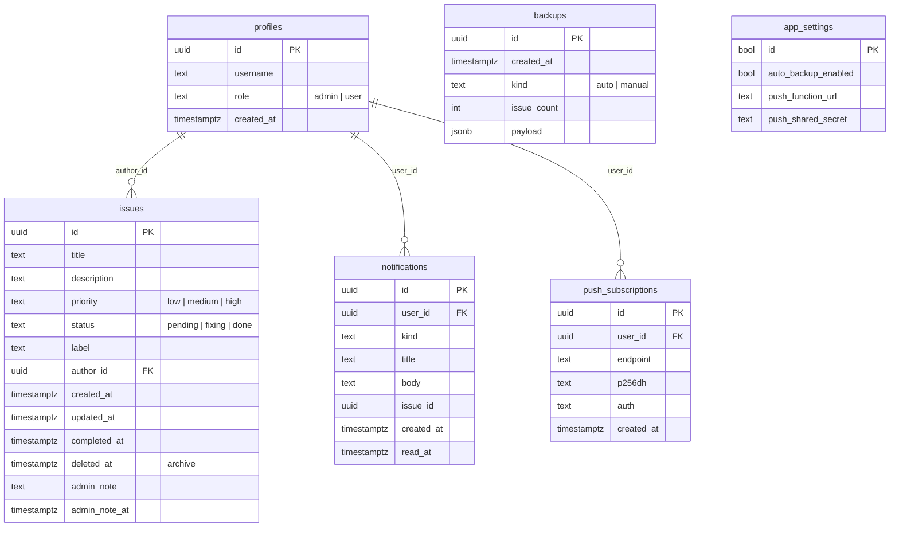

**Users live in two places, on purpose:** Supabase's built-in `auth.users`
(credentials) and `public.profiles` (username + role). A trigger copies a row
across when someone signs up — see §4.

---

## 4. Security model

Two independent layers:

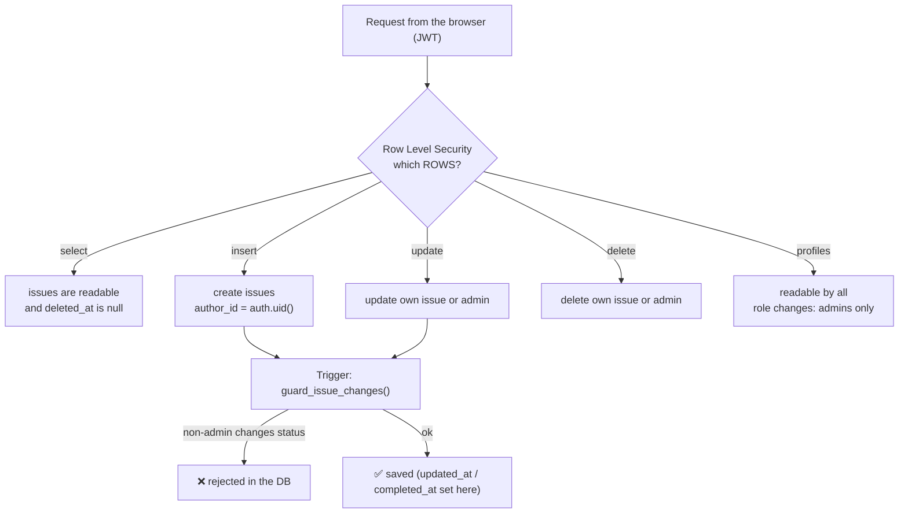

- **`is_admin()`** is `SECURITY DEFINER`, so a policy can look up the caller's
  role without tripping over RLS itself.
- **`handle_new_user()`** runs on sign-up and **computes** the role — it never
  trusts what the browser sends.
- **Admin-only actions** (archive, backups) go through `SECURITY DEFINER`
  functions that re-check `is_admin()` **inside the database**.
- `sql/admin_status_policy.sql` explains why a trigger — not an RLS policy — is
  what protects the `status` column, and includes read-only verification queries.

> The `anon` key in `supabase-config.js` is meant to be public. It grants nothing
> that RLS does not allow.

---

## 5. The left panel, one by one

The sidebar is built by `js/layout.js` from one `NAV` list. Entries flagged
`admin: true` are hidden from reporters; entries flagged `bottom: true` also
appear in the phone's bottom bar. The hamburger opens the sidebar as a drawer on
small screens. **Profile**, **Settings** and **Logout** live in the top-right
profile menu, and the **bell** sits next to it.

```
┌──────────────────────────┐
│  ✓ Issue Tracker         │
│                          │
│  🏠 Dashboard            │  everyone
│  📋 Issues               │  everyone
│  📝 My Reports           │  everyone
│  📊 Reports      (admin) │
│  👥 Users        (admin) │
│  🗄️  Archive      (admin) │
│                          │
│  [ Logout ]              │  pinned to the bottom
└──────────────────────────┘

Top bar:  ☰   Page title      ●live   🔔bell   [ avatar ▾ ]
                                                   ├ Profile
                                                   ├ Settings
                                                   └ Logout
```

Every page begins the same way:

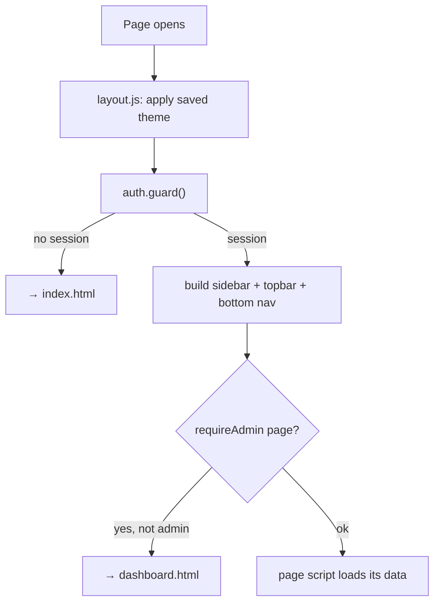

### 5.1 🏠 Dashboard

**What it is for:** a one-glance overview of the whole board.

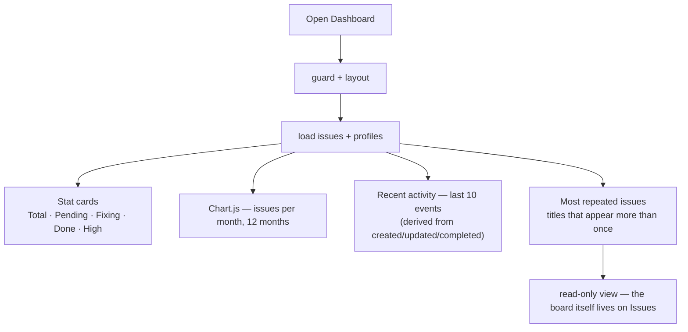

- Source: `js/page-dashboard.js`. It reads **all** issues (RLS lets any signed-in
  user read the board).
- "Most repeated" matches titles ignoring case, spacing and punctuation
  (`Login fails!` = `login-fails`).
- Works for both roles; reporters see the same organisation-wide picture.

### 5.2 📋 Issues — the board

**What it is for:** everything that happens to an issue, all in one screen.

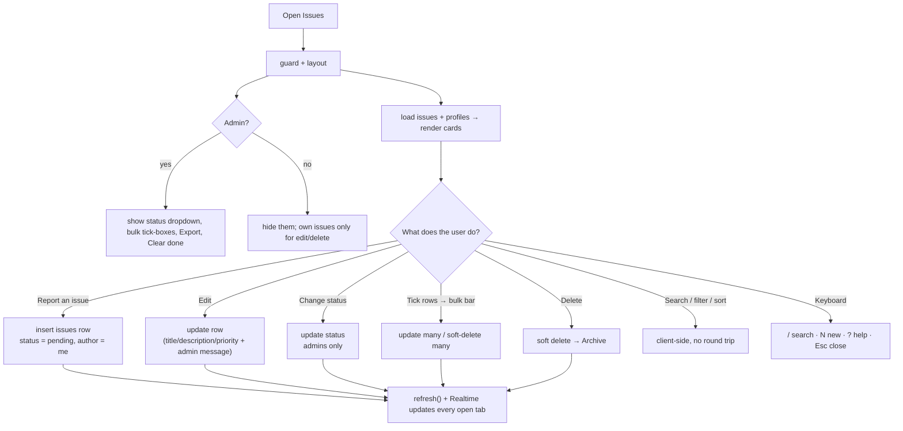

Key behaviours:

- **Sort** (newest / oldest / priority / title) and all filters run **in the
  browser** on the loaded list.
- **Admins cannot rewrite someone else's report** — the title and description are
  read-only for other people's issues; they set status/priority and can leave a
  **message to the reporter** (which the reporter sees on My Reports too).
- **Deleting is not destructive** — it sets `deleted_at` (see §5.6).
- **Stale badge**: an issue open > 7 days shows `Open Nd`.
- **Realtime** keeps every open tab in step without a refresh.

### 5.3 📝 My Reports

**What it is for:** a reporter's own history — including the issues that are
already fixed, and any message an admin left. Read-only, and every role gets it.

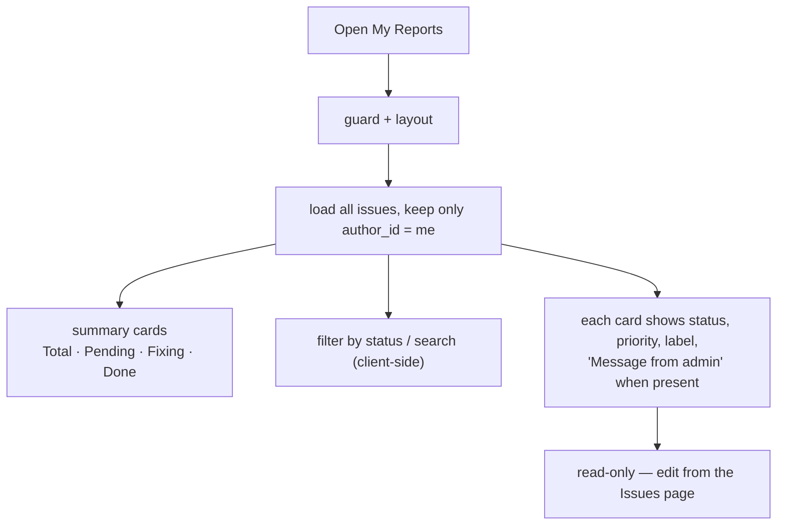

### 5.4 📊 Reports (admin)

**What it is for:** answer "what happened in this period?" and export exactly
that. It never writes to the database.

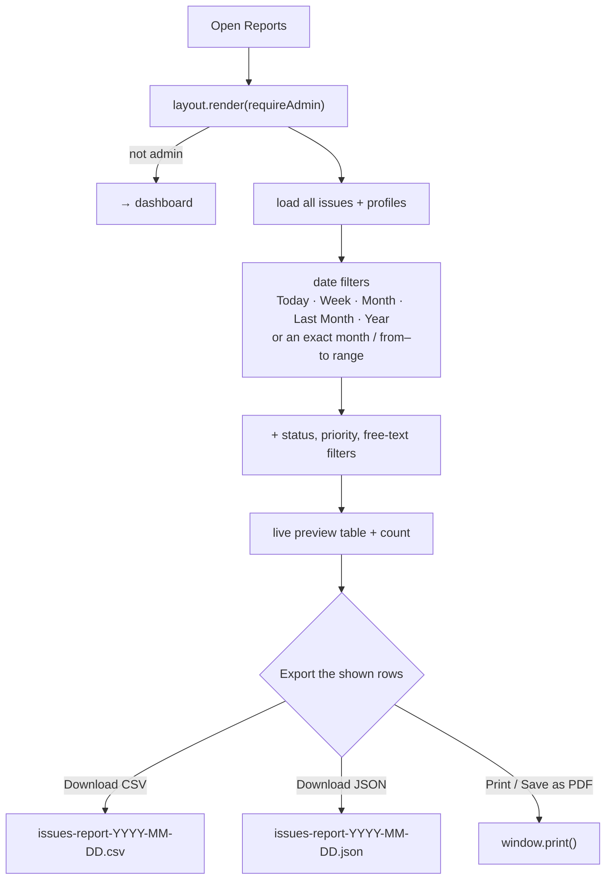

- Source: `js/page-reports.js`. Filtering is client-side, so the preview is
  exactly what gets exported.
- CSV includes a BOM so Excel opens accents correctly.

### 5.5 👥 Users (admin)

**What it is for:** manage who is an admin.

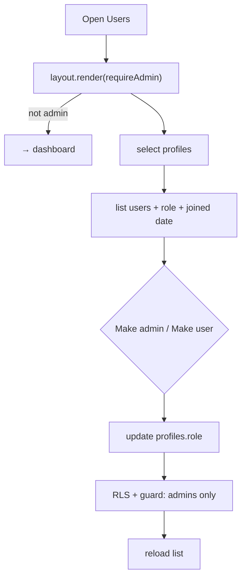

Guards built into the UI **and** the database: you cannot change your **own**
role, and the **last admin** cannot be demoted.

### 5.6 🗄️ Archive (admin)

**What it is for:** undoing a delete. (The table is still called the recycle bin
in SQL; the UI says Archive.)

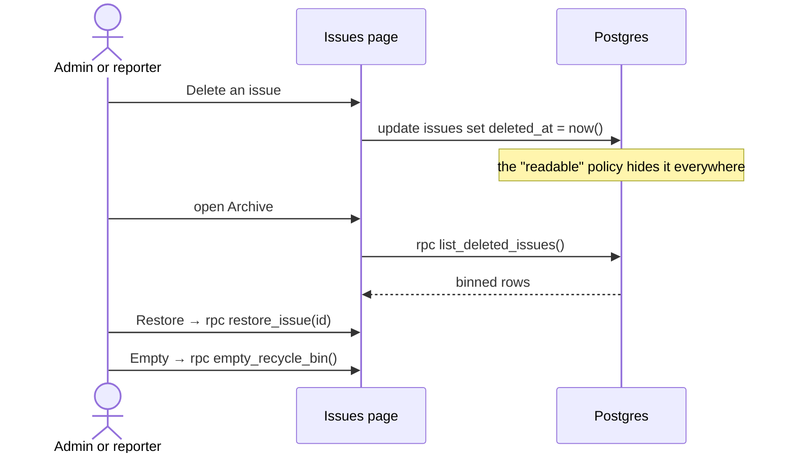

List, the dashboard, the chart and the counts all stop seeing a binned issue
because they read through the same policy.

### 5.7 👤 Profile (top-right account menu)

**What it is for:** your own account, read-only, plus a password change.

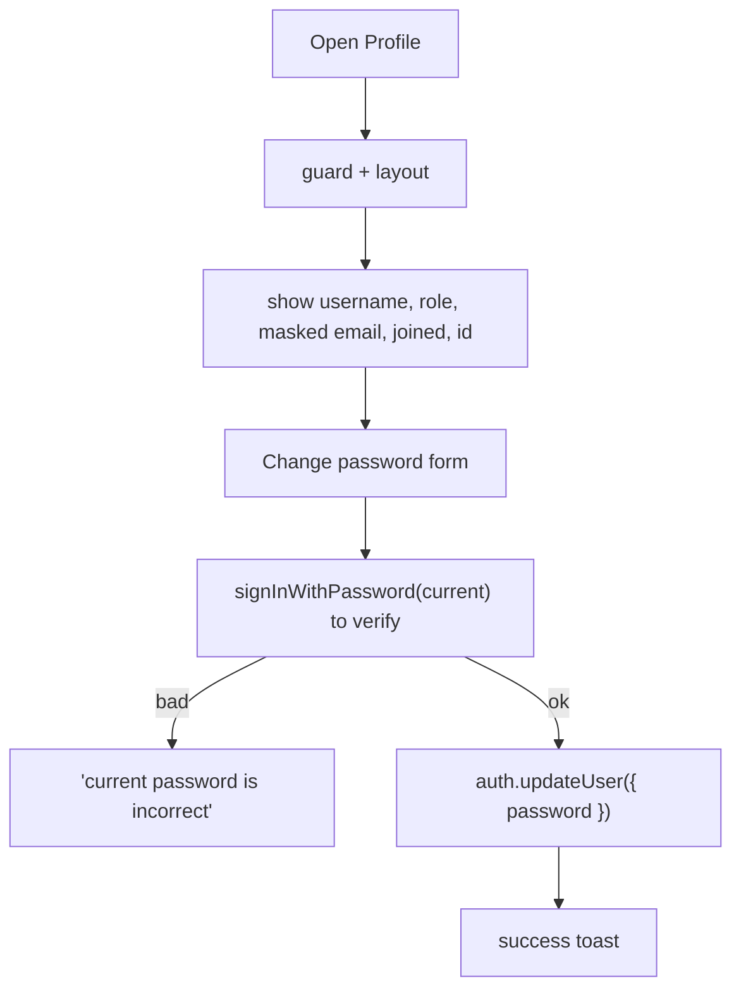

The email is **derived** (`username@domain`) and shown masked.

### 5.8 ⚙️ Settings (top-right account menu)

**What it is for:** device preferences, notifications, and (for admins) backups.

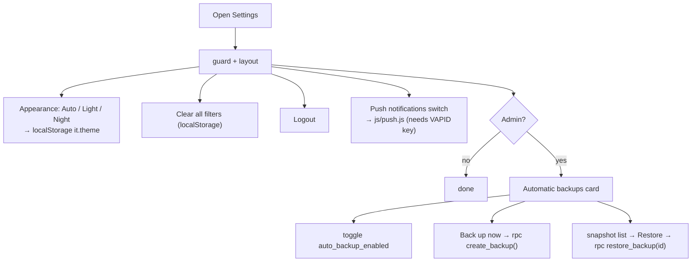

### 5.9 🔔 Notifications (top bar bell)

**What it is for:** tell the right person when something happens, in-app and
(optionally) on their phone. Works for both roles.

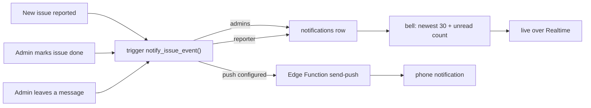

Click the bell to read; **Mark all read** clears the count. If
`sql/notifications.sql` has not been run, the table is missing, the request fails
quietly and the bell simply shows nothing.

### 5.10 Admin status pages (legacy, URL-only)

**What they are for:** the same board, pre-filtered to one status. They are no
longer linked from the sidebar — the Issues status filter replaces them — so
they are reachable by URL only.

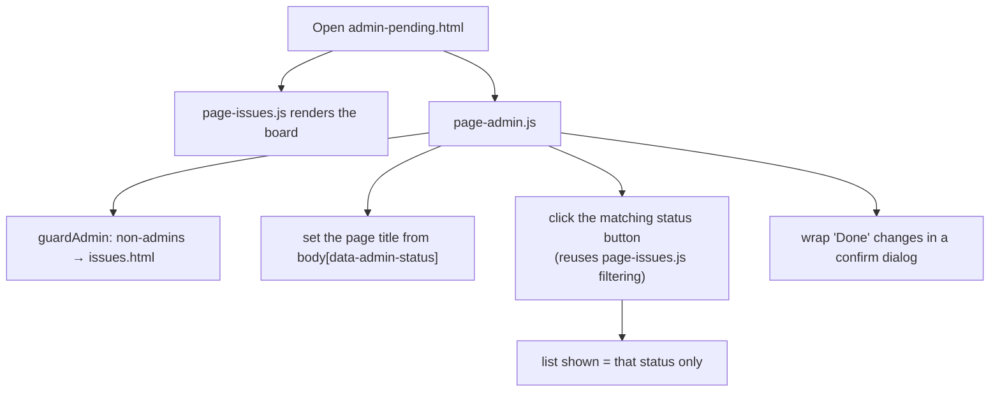

> These pages do **not** duplicate logic — `page-admin.js` only *drives* the
> board that `page-issues.js` already rendered. Add a feature once, in
> `page-issues.js`, and every admin page gets it.

| Page | Filter applied |
|---|---|
| `admin-reported.html` | `pending` ⚠️ (same as Pending — see Gotchas) |
| `admin-pending.html` | `pending` |
| `admin-fixing.html` | `fixing` |
| `admin-done.html` | `done` |
| `admin-all.html` | none (all) |

---

## 6. Cross-cutting behaviour

### Live updates
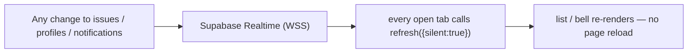

### Appearance (Auto / Light / Night)
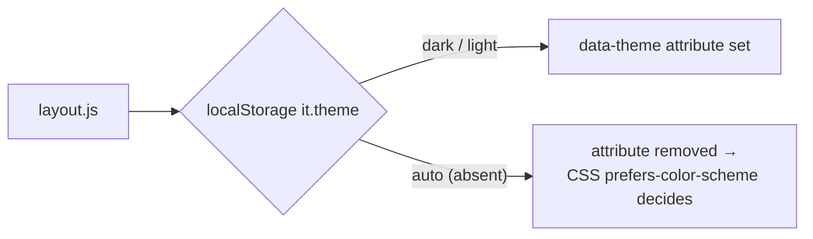

### Install as an app (PWA)
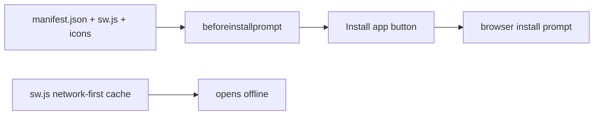

### Notifications & push
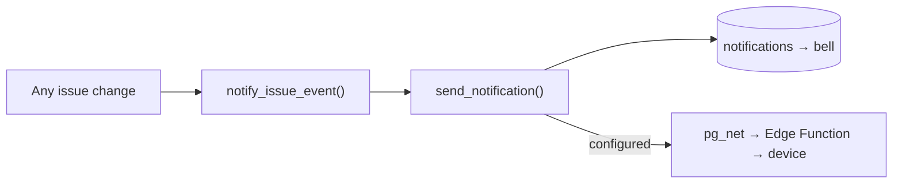

### Automatic backups
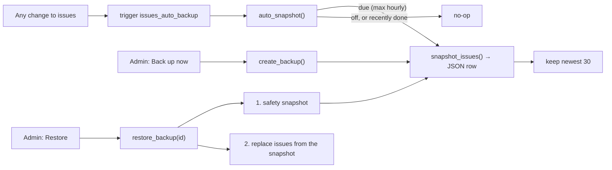

---

## 7. One request, end to end

```mermaid
sequenceDiagram
  actor U as Admin
  participant P as issues.html + page-issues.js
  participant API as Supabase PostgREST
  participant DB as Postgres
  U->>P: set status to Done
  P->>API: update issues set status='done'
  API->>DB: apply
  DB->>DB: RLS — author or admin? ✅
  DB->>DB: guard_issue_changes() — admin? ✅ (sets completed_at)
  DB->>DB: issues_auto_backup → maybe snapshot
  DB->>DB: notify_issue_event() → notification for the reporter
  DB-->>API: row
  API-->>P: 200 OK
  API-->>P: Realtime event → other tabs refresh
  P-->>U: toast "Status changed to Done"
```

---

## 8. Running, deploying and setting up (for a newcomer)

### First-time setup
1. Create a free project at **supabase.com**.
2. **SQL Editor → New query** → paste `supabase/schema.sql` → **Run**. Then
   paste `sql/APPLY-ALL.sql` → **Run** (notifications, push, backups, archive).
3. **Settings → API** → copy the **Project URL** and **anon** key into
   `supabase-config.js`.
4. Open the site and register. **The first account is made the admin** (see
   `SETUP.md`).

### Run locally
```powershell
python -m http.server 8000     # then open http://localhost:8000
```
Don't double-click the file — a `file://` origin is blocked by CORS when talking
to Supabase.

### Deploy
```mermaid
flowchart LR
  D["Edit files"] --> G["git commit + push (develop)"]
  G --> GH["GitHub: rawrmeo/issue-tracker"]
  GH --> V["merge develop → main"]
  V --> L["Vercel builds & deploys"]
```
`vercel.json` adds clean URLs and security headers; `.vercelignore` keeps local
secrets out.

### Regenerate the diagrams
```powershell
powershell -ExecutionPolicy Bypass -File tools/build-flowcharts.ps1
```

---

## 9. Common maintenance recipes

| I want to… | Do this |
|---|---|
| **Add a field to an issue** | `alter table … add column if not exists` → add it to `mapIssue()` in `page-issues.js` + `page-dashboard.js` → show it in `issueCard()` |
| **Add a new page** | Copy a `pages/*.html`, point it at the shared scripts, add `ET.layout.render({ active, title })`, then add it to `NAV` in `layout.js` (sidebar **and** bottom nav) |
| **Change who can do something** | Edit the RLS policies / `guard_issue_changes()` in `supabase/schema.sql` — **not** just the button |
| **Add an admin action** | Write a `SECURITY DEFINER` function that checks `is_admin()`, then call it with `sb.rpc(...)` |
| **Change the colours** | `styles.css` (`:root` and the dark block) |
| **Change the menu** | `js/layout.js` (`NAV`) |
| **Change the bell** | `js/notifications.js` + `sql/notifications.sql` |
| **Test with sample data** | Run `sql/demo_data.sql` (only fills an empty board) |

---

## 10. Gotchas & known quirks

- The **admin status pages** (`admin-*.html`) still exist but are no longer
  linked from the sidebar — the Issues status filter replaces them, so they are
  reachable by URL only.
- **"Reported" and "Pending"** admin pages apply the **same** `pending` filter
  (`admin-reported.html` has `data-admin-status="pending"`).
- **`app.html` / `app.js`** are leftovers from the single-page version; nothing
  links to them.
- **The admin-message, archive, backup, notification and push features need
  their SQL run once.** `sql/APPLY-ALL.sql` does all of them; until then the app
  degrades gracefully (hard delete, no message, empty bell).
- **OneDrive is not used** for this repo — keep it out of cloud-sync folders so
  `.git` is never re-synced mid-write.
- **`supabase-config.js` is public on purpose.** Never put a `service_role` key
  there.
- **Roles are chosen at sign-up** in this build (first user = admin); a new
  maintainer may want to lock sign-ups down and promote people from the Users
  page instead.
- The **Reports** export runs entirely in the browser, so it exports what RLS
  lets the signed-in admin read.

---

## 11. Quick index

| Question | Answer |
|---|---|
| Where does a request start? | `index.html` → `pages/dashboard.html` |
| Where is the app shell? | `js/layout.js` + `css/app.css` |
| Where is all data access? | `js/supabase.js` (one client) + `page-*.js` |
| Where are the rules? | `supabase/schema.sql` — RLS + `guard_issue_changes()` |
| Where are the admin RPCs? | `sql/recycle_bin.sql`, `sql/backups.sql` |
| Where are notifications? | `sql/notifications.sql`, `js/notifications.js`, `js/push.js` |
| Where is the push sender? | `supabase/functions/send-push/index.ts` |
| Where is the theme? | `js/layout.js` + `styles.css` (`prefers-color-scheme`) |
| Where is the PWA? | `manifest.json`, `sw.js`, `js/install.js` |
| Where is the deployment? | `vercel.json`, `.vercelignore`, `deploy.ps1` |
| Where are the diagrams? | `flowcharts.html`, generated by `tools/build-flowcharts.ps1` |
