# Handover & Architecture Guide

> **Read this first.** Everything a new maintainer needs to understand, run and
> extend this project. Diagrams are [Mermaid](https://mermaid.js.org/) and render
> on GitHub.

---

## 0. Abstract

**What it is.** A **multiuser issue tracker** that runs entirely in the browser.
There is no server of your own: the pages are static files hosted on Vercel, and
all data, login and access rules live in **Supabase** (hosted Postgres + Auth).

**Who uses it.**

| Role | Can do |
|---|---|
| **User** (reporter) | Sign in, report issues, search the board, edit/delete their **own** issues, change their password |
| **Admin** | Everything above, plus set **status** (pending → fixing → done), manage users, use bulk actions, restore from the **recycle bin**, and run **backups** |

**The one rule that shapes everything:** only an **admin** may move an issue
through its statuses. That rule is enforced **in the database** (Row Level
Security + a trigger), not just hidden in the UI — so a hand-crafted API call
cannot bypass it.

**In one picture:**

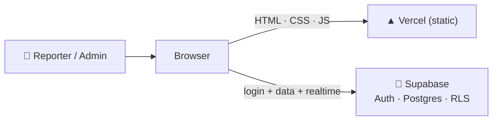

**Why it is built this way.** A single static front end means no server to run or
patch. Putting the rules in Postgres means the security travels with the data.

---

## 1. Technology

| Layer | Choice | Why |
|---|---|---|
| Markup / style | Plain HTML, CSS, vanilla JS | No build step — open a file and it runs |
| Hosting | **Vercel** (static) | Free, HTTPS, instant deploys |
| Database | **Supabase Postgres** | Relational data + one place for rules |
| Auth | **Supabase Auth** | Password login, JWT sessions |
| API | **PostgREST** (auto) | `sb.from('issues')…` talks to tables directly |
| Live updates | **Supabase Realtime** | WebSocket; boards update without refresh |
| Offline / install | **Service worker + manifest** | Home-screen app on a phone |
| Charts | Chart.js (CDN) | Dashboard graph |

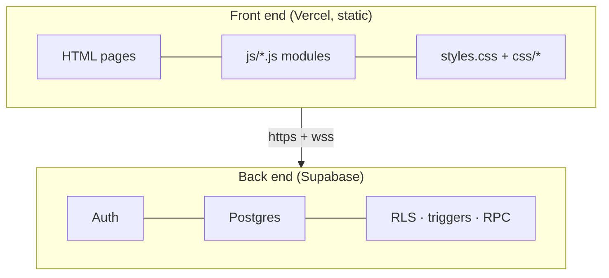

---

## 2. Repository map

Every file, and what it is for. **This is the map to read when you take over.**

### Root

| File | Purpose |
|---|---|
| `index.html` | **Entry point** — sign in / create account. Redirects into `pages/` once signed in. |
| `app.html` | Legacy single-page shell, not part of the current flow |
| `styles.css` | Global design tokens (`--accent`, dark theme) and base components |
| `enhancements.css` / `enhancements.js` | Extra polish (date filter bar etc.) loaded on the Issues page |
| `supabase-config.js` | **Your** Supabase URL + anon key (public by design) |
| `manifest.json`, `sw.js`, `icon-*.png`, `apple-touch-icon.png` | Make it installable (`js/install.js` uses them) |
| `vercel.json` | Clean URLs + security headers |
| `.vercelignore` | Keeps `.env*` and other local files out of deploys |
| `deploy.ps1` | Windows helper: commit + push in one command |
| `README.md`, `SETUP.md`, `ARCHITECTURE.md`, `HANDOVER.md` | Docs |
| `supabase/schema.sql` | **The whole database** — tables, policies, triggers, functions |
| `sql/*.sql` | Focused migrations: `admin_note`, `recycle_bin`, `backups`, `demo_data` |

### `pages/` — the app screens

| Page | Purpose | Script |
|---|---|---|
| `dashboard.html` | Overview: stats, chart, repeated issues, activity | `page-dashboard.js` |
| `issues.html` | The board (report, filter, edit, bulk) | `page-issues.js` |
| `users.html`, `admin-users.html` | Manage accounts | `page-users.js` |
| `profile.html` | Own details + password | `page-profile.js` |
| `settings.html` | Appearance, filters, backups | `page-settings.js` |
| `recycle-bin.html` | Restore / empty deleted issues | `page-bin.js` |
| `admin-all.html` | All issues (admin view) | `page-issues.js` + `page-admin.js` |
| `admin-reported.html` | Reported (status filter = pending) | `page-issues.js` + `page-admin.js` |
| `admin-pending.html` | Pending | `page-issues.js` + `page-admin.js` |
| `admin-fixing.html` | Fixing | `page-issues.js` + `page-admin.js` |
| `admin-done.html` | Done | `page-issues.js` + `page-admin.js` |

### `js/` — the code

| Module | Loaded by | Responsibility |
|---|---|---|
| `supabase.js` | every page | Creates the **one** client, plus helpers (`escapeHtml`, `formatDate`, `timeAgo`, `friendlyError`) and constants (`STATUSES`, `PRIORITY_RANK`, `ADMIN`) |
| `auth.js` | every page | `initLoginPage()`, `guard()`, `isAdmin()`, `logout()`, `user` |
| `layout.js` | app pages | Builds the **sidebar**, **topbar**, theme control and **mobile bottom nav**; exposes `ET.layout.render()` |
| `sidebar.js` | app pages | Adds the **admin-only** links (Reported…Recycle bin) to the sidebar |
| `toast.js` | every page | `ET.toast(msg)` |
| `modal.js` | every page | `ET.confirm()` promise-based dialog |
| `install.js` | every page | **Install app** button (`beforeinstallprompt` / iOS hint) |
| `page-dashboard.js` | dashboard | Stats, chart, repeated issues, activity |
| `page-issues.js` | issues + admin-* | The whole board: list, filters, create/edit, status, delete, bulk actions, shortcuts, realtime |
| `page-admin.js` | admin-* | Applies the page's status filter and adds a confirm before Done |
| `page-users.js` | users pages | List accounts, promote/demote |
| `page-profile.js` | profile | Read-only details + change password |
| `page-settings.js` | settings | Appearance, clear filters, logout, backups |
| `page-bin.js` | recycle-bin | List / restore / empty the bin |

### `css/`

| File | Purpose |
|---|---|
| `css/app.css` | Shell: sidebar + topbar + content grid, plus the mobile drawer |
| `css/pages.css` | Per-page pieces (stats, cards, issue list) |
| `css/sidebar.css` | The admin sidebar section and role badge |
| `css/mobile-nav.css` | The mobile bottom navigation bar |
| `css/features.css` | Stale badge, bulk bar, admin message, repeated list, shortcuts, backups |

---

## 3. Data model

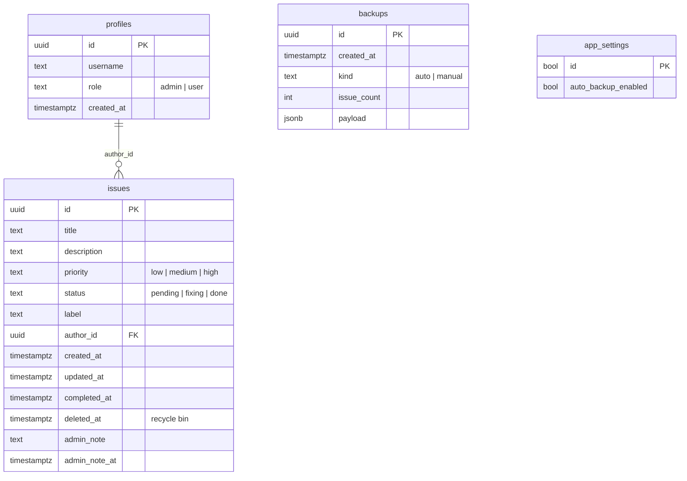

**Users live in two places, on purpose:** Supabase's built-in `auth.users`
(credentials) and `public.profiles` (username + role). A trigger copies a row
across when someone signs up — see §4.

---

## 4. Security model

Two independent layers:

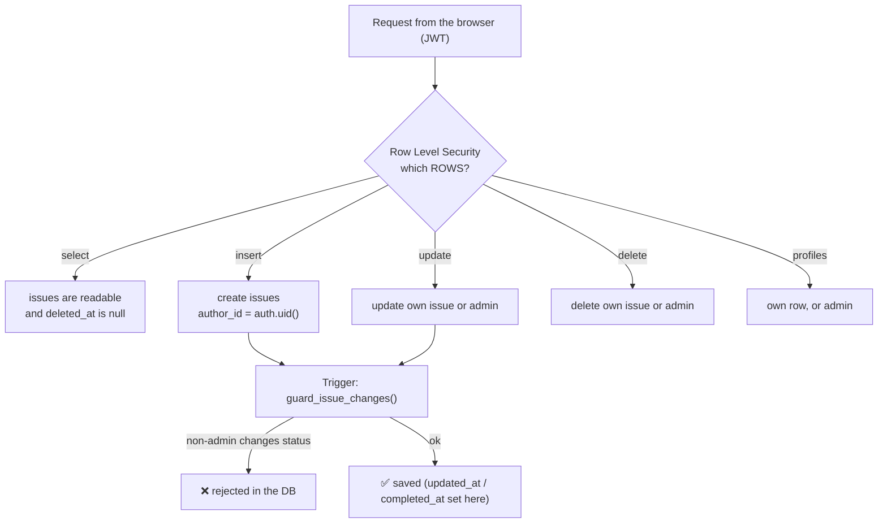

- **`is_admin()`** is `SECURITY DEFINER`, so a policy can look up the caller's
  role without tripping over RLS itself.
- **`handle_new_user()`** runs on sign-up and **computes** the role — it never
  trusts what the browser sends.
- **Admin-only actions** (recycle bin, backups) go through `SECURITY DEFINER`
  functions that re-check `is_admin()` **inside the database**.

> The `anon` key in `supabase-config.js` is meant to be public. It grants nothing
> that RLS does not allow.

---

## 5. The left panel, one by one

The sidebar is built by `js/layout.js` (main links) and `js/sidebar.js` (admin
links). On a phone the same main links appear as a **bottom bar**, and the
hamburger opens the sidebar as a drawer.

```
┌──────────────────────────┐
│  ✓ Issue Tracker         │
│                          │
│  🏠 Dashboard            │  main nav (everyone)
│  📋 Issues               │
│  👥 Users        (admin) │
│  👤 Profile              │
│  ⚙️  Settings             │
│                          │
│  Admin           (admin) │
│  📥 Reported             │
│  ⏳ Pending               │
│  🔧 Fixing                │
│  ✅ Done                  │
│  👥 Users                 │
│  🗑️  Recycle bin           │
│  ─────────────────────   │
│  🏠 All issues            │
│                          │
│  [ you · role ]          │
│  [ Install app ] (maybe) │
│  [ Logout ]              │
└──────────────────────────┘
```

Every page begins the same way:

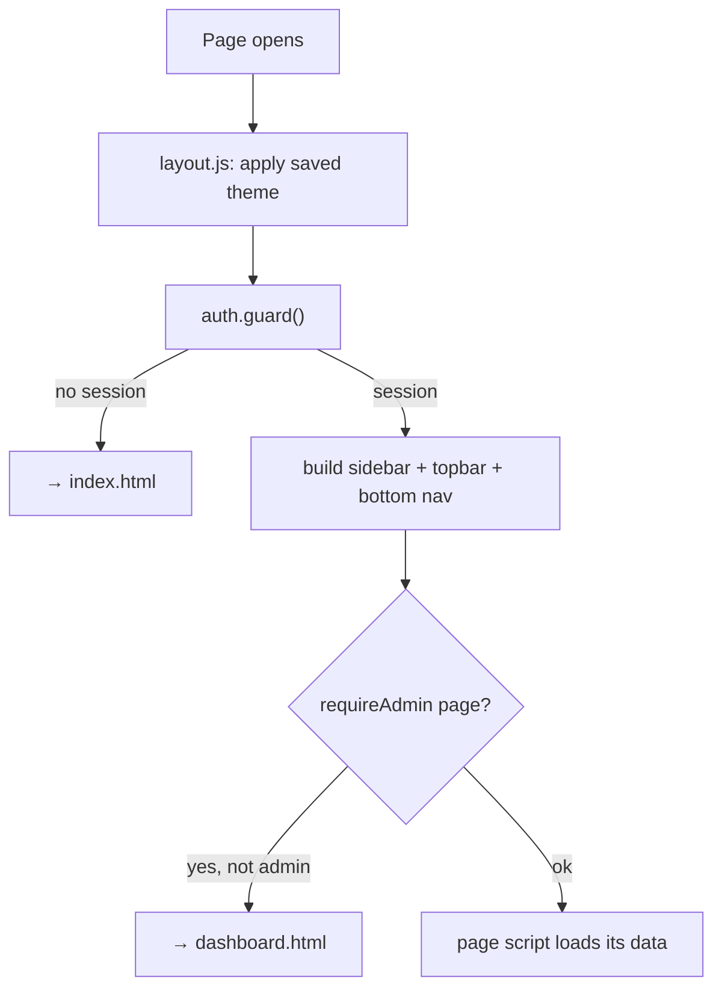

### 5.1 🏠 Dashboard

**What it is for:** a one-glance overview of the whole board.


- Source: `js/page-dashboard.js`. It reads **all** issues (RLS lets any signed-in
  user read the board).
- "Most repeated" matches titles ignoring case, spacing and punctuation
  (`Login fails!` = `login-fails`).

### 5.2 📋 Issues — the board

**What it is for:** everything that happens to an issue, all in one screen.

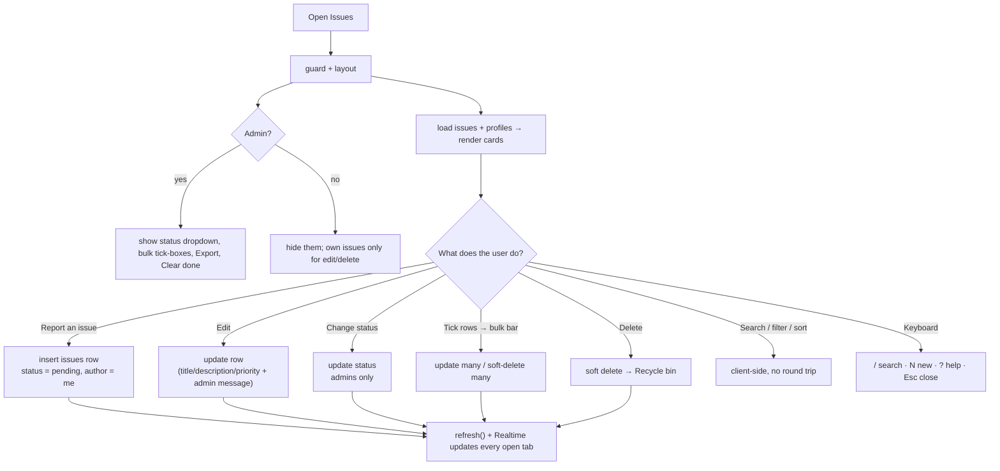

Key behaviours:

- **Sort** (newest / oldest / priority / title) and all filters run **in the
  browser** on the loaded list.
- **Admins cannot rewrite someone else's report** — the title and description are
  read-only for other people's issues; they set status/priority and can leave a
  **message to the reporter**.
- **Deleting is not destructive** — it sets `deleted_at` (see §5.7).
- **Stale badge**: an issue open > 7 days shows `Open Nd`.

### 5.3 👥 Users (admin)

**What it is for:** manage who is an admin.

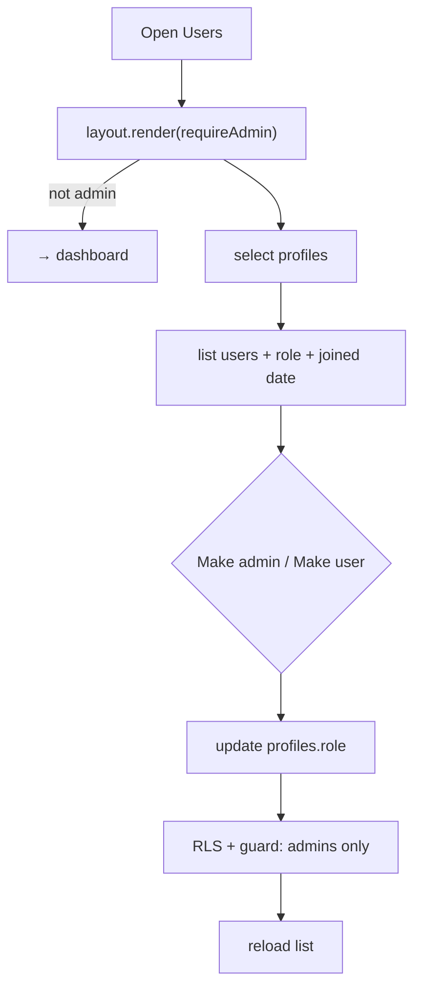

Guards built into the UI **and** the database: you cannot change your **own**
role, and the **last admin** cannot be demoted.

### 5.4 👤 Profile

**What it is for:** your own account, read-only, plus a password change.

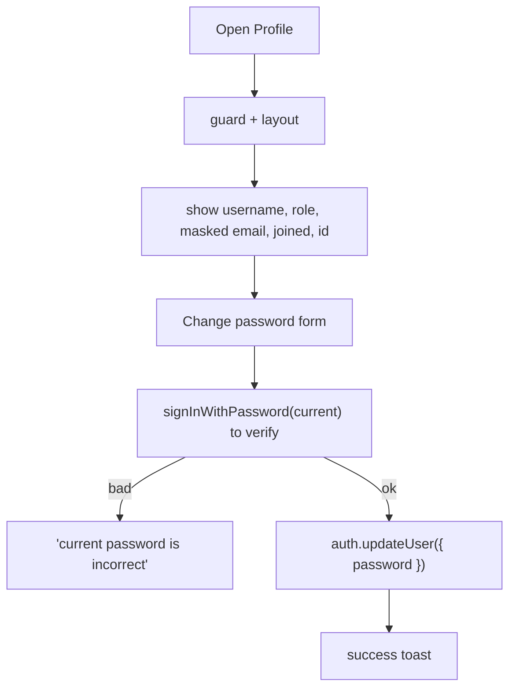

The email is **derived** (`username@domain`) and shown masked.

### 5.5 ⚙️ Settings

**What it is for:** device preferences, and (for admins) backups.

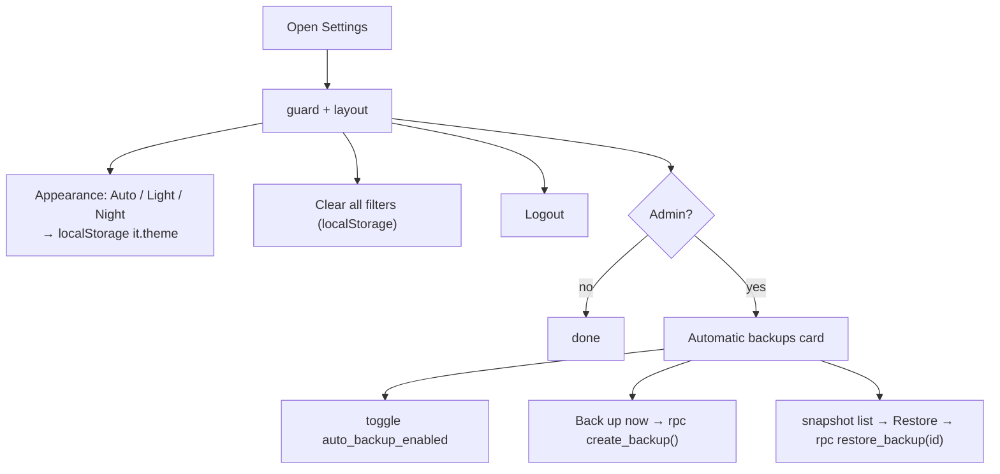

### 5.6 Admin status pages (Reported · Pending · Fixing · Done · All issues)

**What they are for:** the same board, pre-filtered to one status.

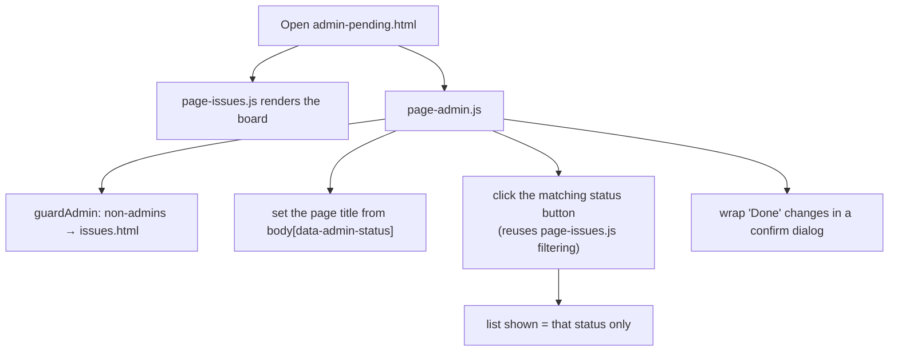

> These pages do **not** duplicate logic — `page-admin.js` only *drives* the
> board that `page-issues.js` already rendered. Add a feature once, in
> `page-issues.js`, and every admin page gets it.

| Page | Filter applied |
|---|---|
| `admin-reported.html` | `pending` ⚠️ (same as Pending — see Gotchas) |
| `admin-pending.html` | `pending` |
| `admin-fixing.html` | `fixing` |
| `admin-done.html` | `done` |
| `admin-all.html` | none (all) |

### 5.7 🗑️ Recycle bin (admin)

**What it is for:** undoing a delete.

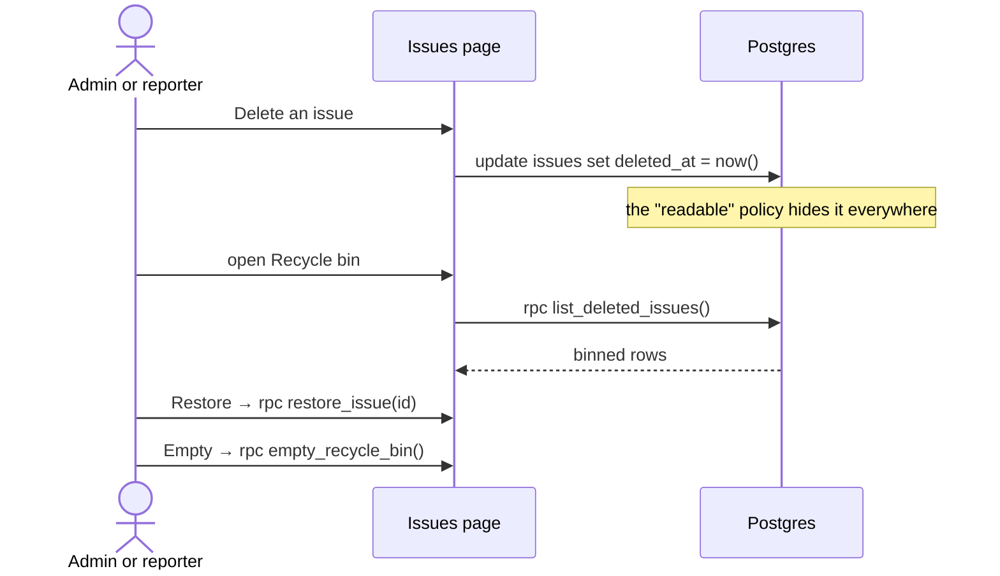

`List`, the dashboard, the chart and the counts all stop seeing a binned issue
because they read through the same policy.

---

## 6. Cross-cutting behaviour

### Live updates
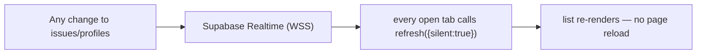

### Appearance (Auto / Light / Night)
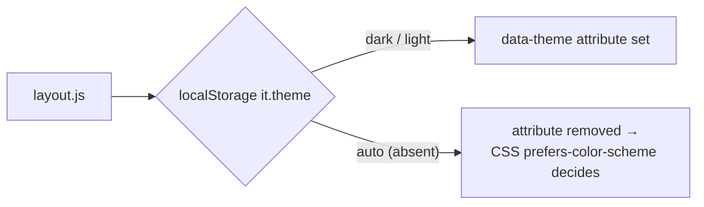

### Install as an app (PWA)
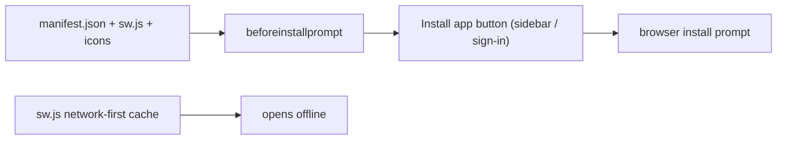

### Automatic backups
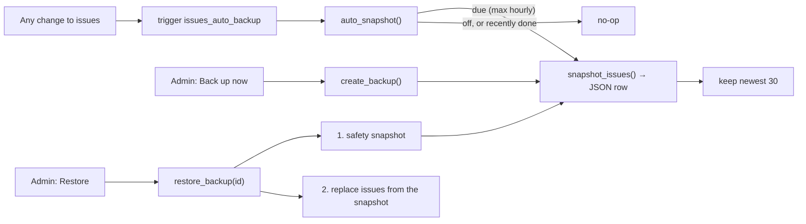

---

## 7. One request, end to end

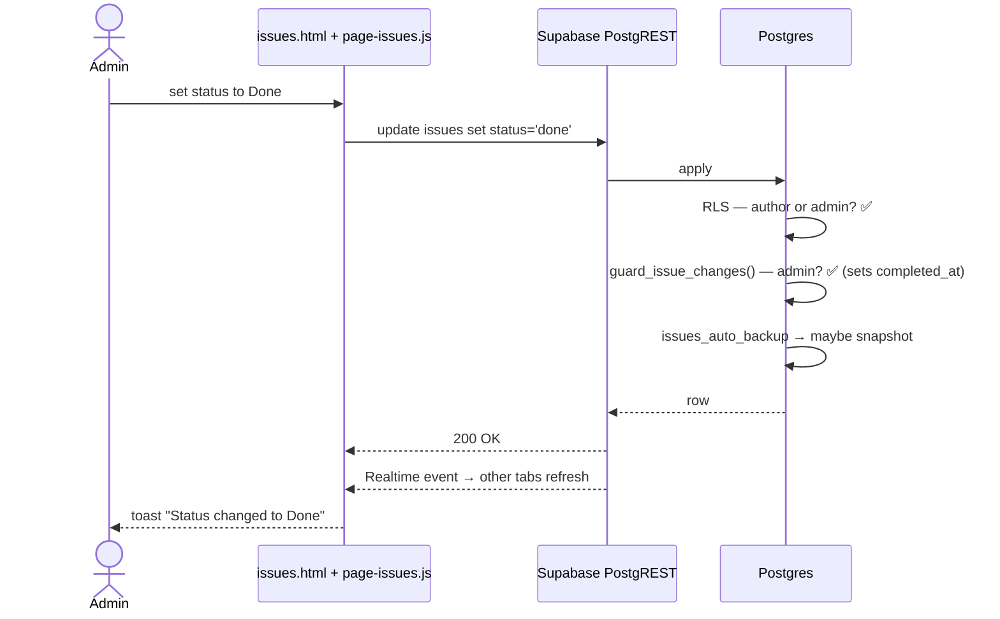

---

## 8. Running, deploying and setting up (for a newcomer)

### First-time setup
1. Create a free project at **supabase.com**.
2. **SQL Editor → New query** → paste `supabase/schema.sql` → **Run**.
   (For an existing database, the focused files in `sql/` are enough.)
3. **Settings → API** → copy the **Project URL** and **anon** key into
   `supabase-config.js`.
4. Open `index.html` (or the deployed site) and register. **The first account
   should be made an admin** (see `SETUP.md`).

### Run locally
```powershell
python -m http.server 8000     # then open http://localhost:8000
```
Don't double-click the file — a `file://` origin is blocked by CORS when talking
to Supabase.

### Deploy
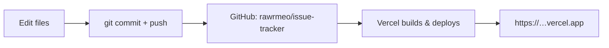
`vercel.json` adds clean URLs and security headers; `.vercelignore` keeps local
secrets out. A commit also auto-pushes (git hook).

---

## 9. Common maintenance recipes

| I want to… | Do this |
|---|---|
| **Add a field to an issue** | `alter table … add column if not exists` → add it to `mapIssue()` in `page-issues.js` + `page-dashboard.js` → show it in `issueCard()` |
| **Add a new page** | Copy a `pages/*.html`, point it at the shared scripts, add `ET.layout.render({ active, title })`, then add it to `NAV` in `layout.js` (sidebar **and** bottom nav) |
| **Change who can do something** | Edit the RLS policies / `guard_issue_changes()` in `supabase/schema.sql` — **not** just the button |
| **Add an admin action** | Write a `SECURITY DEFINER` function that checks `is_admin()`, then call it with `sb.rpc(...)` |
| **Change the colours** | `styles.css` (`:root` and the dark block) |
| **Change the sidebar** | `js/layout.js` (`NAV`) for everyone; `js/sidebar.js` (`ADMIN_LINKS`) for admins |
| **Test with sample data** | Run `sql/demo_data.sql` (only fills an empty board) |

---

## 10. Gotchas & known quirks

- **Two "Users" entries** in the sidebar (main nav + admin section) — both open
  `users.html`.
- **"Reported" and "Pending"** admin pages currently apply the **same** `pending`
  filter (`admin-reported.html` has `data-admin-status="pending"`). If "Reported"
  should mean something else, change that attribute or the filter.
- **`app.html`** is a leftover from the single-page version; nothing links to it.
- **The admin-message, recycle-bin and backup features need their SQL run once.**
  Until then the app falls back to hard delete and skips the message.
- **OneDrive is not used** for this repo — keep it out of cloud-sync folders so
  `.git` is never re-synced mid-write.
- **`supabase-config.js` is public on purpose.** Never put a `service_role` key
  there.
- **Roles are chosen at sign-up** in this build; a new maintainer may want to
  lock that down and promote people from the Users page instead.

---

## 11. Quick index

| Question | Answer |
|---|---|
| Where does a request start? | `index.html` → `pages/dashboard.html` |
| Where is the app shell? | `js/layout.js` + `css/app.css` |
| Where is all data access? | `js/supabase.js` (one client) + `page-*.js` |
| Where are the rules? | `supabase/schema.sql` — RLS + `guard_issue_changes()` |
| Where are the admin RPCs? | `sql/recycle_bin.sql`, `sql/backups.sql` |
| Where is the theme? | `js/layout.js` + `styles.css` (`prefers-color-scheme`) |
| Where is the PWA? | `manifest.json`, `sw.js`, `js/install.js` |
| Where is the deployment? | `vercel.json`, `.vercelignore` |
