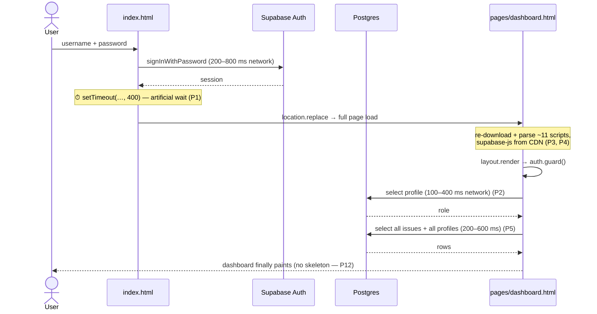

# Issues & Performance Review

A prioritised list of things that can slow the app down or break it, with the
evidence (file + line) and a concrete fix for each. The example used to frame it
is the **~2 second sign-in**, which is real and has a specific cause.

Legend — **Severity**: 🔴 high · 🟠 medium · 🟡 low. **Effort**: S (hours) ·
M (days) · L (a week+).

---

## 0. Summary

| # | Issue | Severity | Effort | Payoff |
|---|---|---|---|---|
| P1 | Artificial 400 ms delay before redirecting after sign-in | 🔴 | S | Instant win |
| P2 | `auth.guard()` hits the network for the profile on **every** page load | 🔴 | M | Big |
| P3 | Every menu click is a **full page reload** (multi-page app) | 🔴 | L | Big |
| P4 | Scripts load synchronously from a CDN, with no `defer`/preconnect | 🟠 | S | Medium |
| P5 | Issues are loaded with **no limit** everywhere (`select('*')`) | 🔴 | M | Big at scale |
| P6 | My Reports downloads **all** issues then filters to your own in JS | 🟠 | S | Medium |
| P7 | `enhancements.js` re-downloads the whole issue id/date list on **every** render | 🔴 | S | Big |
| P8 | Realtime refetches the **entire** table for every change, per client | 🟠 | M | Medium |
| P9 | Restoring a backup **notifies every admin about every restored issue** | 🔴 | S | Correctness |
| P10 | First sign-up wins admin by a **race** (two people can both be first) | 🟠 | S | Correctness |
| P11 | `select('*')` over-fetches (2000-char descriptions) where not needed | 🟡 | S | Small |
| P12 | Full-list `innerHTML` re-render on every keystroke / realtime event | 🟠 | M | Medium |
| P13 | Hourly backup serialises the **whole** issue table to JSON | 🟠 | M | Storage |
| P14 | Notifications grow without bound; no retention | 🟡 | S | Small |
| P15 | A transient network error on load **signs the user out** | 🟠 | S | Reliability |
| P16 | CDN dependency: a CDN outage shows "Connect your database" | 🟠 | M | Reliability |
| P17 | `vercel.json` has no CSP / HSTS / cache headers | 🟡 | S | Security |
| P18 | No automated tests, CI or error monitoring | 🟠 | M | Confidence |
| P19 | Database changes are untracked files, no migrations table | 🟠 | M | Safety |
| P20 | Sign-ups are open and email confirmation is off | 🟡 | S | Security |

---

## 1. Sign-in is slow (~2 s) — the timeline

The 2 seconds is not one thing; it is four stacked costs.



### P1 🔴 Remove the artificial sign-in delay — S

**Evidence:** `js/auth.js:100` and `js/auth.js:142`:

```js
setTimeout(function () { ET.go('pages/dashboard.html'); }, 400);
```

**Impact:** a fixed 400 ms of dead time on every login and sign-up, purely so a
toast can be seen.

**Fix:** navigate immediately. Keep the toast on the destination page (it already
has one), or show it and navigate in the same tick.

```js
ET.toast('Signed in as ' + username + '.');
ET.go('pages/dashboard.html');          // no setTimeout
```

### P2 🔴 Don't re-fetch the profile on every page load — M

**Evidence:** `js/auth.js:175-208`. `guard()` runs on every page and does
`getSession()` **plus** a network `select … from profiles where id = …`.

**Impact:** every single navigation pays a profile round trip before anything
renders, even though the role rarely changes.

**Fix (in order of value):**
1. Cache the resolved user (`{id, username, role, createdAt}`) in
   `sessionStorage`, keyed by user id, and render from it immediately; refresh it
   in the background (`guard({ revalidate: true })`).
2. Or put the role in the JWT's `app_metadata` and read it from the session — no
   query at all. A role change then needs a token refresh (Supabase emits
   `TOKEN_REFRESHED`), which is acceptable.
3. Keep the profile fetch only for the first load per browser session.

### P3 🔴 Every menu click is a full page reload — L

**Evidence:** each screen is its own document (`pages/*.html`), and
`ET.go()` uses `location.replace` (`js/supabase.js:46-48`).

**Impact:** ~11 `<script>` tags, 3–7 stylesheets and the Supabase client are
re-parsed and re-initialised on every click; the shell flashes.

**Fix:**
- **Cheap:** `prefetch` / `<link rel="prefetch">` the other pages on `mouseover`,
  and add `defer` to all page scripts so HTML parses first.
- **Structural:** convert the shell to a single-page app: one HTML shell, a
  client-side router (`ET.router`) that swaps `<main>` content and calls the
  page's `init()`. The per-page scripts already have a clean
  `init()` + `render({active, title})` shape, so this is very feasible. Keep the
  current pages as-is for deep links and have them load the shell.

### P4 🟠 Load scripts efficiently — S

**Evidence:** `index.html:130-137`, `pages/dashboard.html:103-116` — every
`<script>` is parser-blocking and the two big libraries come from jsDelivr with
an unpinned major (`@supabase/supabase-js@2`, `chart.js@4`).

**Fix:**
- Add `rel="preconnect"` for `https://<project>.supabase.co` and
  `https://cdn.jsdelivr.net`.
- Add `defer` to every local script (they only need the DOM).
- Load `chart.js` only on the dashboard (already) and with `defer`.
- **Self-host** `supabase-js` (one minified file in `js/vendor/`) so the app does
  not depend on a third-party CDN at runtime.

---

## 2. Data loading and scaling

### P5 🔴 Stop loading the whole issues table with `select('*')` — M

**Evidence:**
- `js/page-issues.js:108`
- `js/page-dashboard.js:272`
- `js/page-reports.js:258`
- `js/page-my-reports.js:130`

**Impact:** every board, dashboard and report pulls **every issue, every
column**, including the 2000-character description, with no `limit`. Latency and
memory grow linearly with history. The dashboard only needs counts; Reports
filters by date client-side.

**Fix:**
- Add pagination / infinite scroll to Issues: `.order('created_at',{ascending:false}).range(0,49)` then fetch more on scroll.
- Dashboard: replace client-side aggregation with one RPC
  (`public.dashboard_stats()`) returning the five counts, so it fetches a handful
  of numbers instead of every row.
- Reports: move the date range into the query
  (`.gte('created_at', from).lt('created_at', to)`), which uses
  `issues_created_at_idx`.

### P6 🟠 My Reports fetches the whole table to show one person's rows — S

**Evidence:** `js/page-my-reports.js:130-138` — `select('*')` then
`.filter(it => it.authorId === user.id)`.

**Impact:** a reporter with 3 issues downloads thousands of other people's
issues.

**Fix:** let the database do it — `issues_author_idx` already exists:

```js
sb.from('issues').select('*').eq('author_id', user.id).order('updated_at', { ascending: false })
```

### P7 🔴 `enhancements.js` re-downloads the entire id/date list on every render — S

**Evidence:** `enhancements.js:198-212` (`ensureIndex` → `restGet('issues?select=id,created_at')`)
is called from the `MutationObserver` on `#issueList` (`enhancements.js:425-435`).
`ensureIndex` only guards on `indexLoading`, so once a load finishes every later
list mutation triggers **another** full-table fetch.

**Impact:** on the Issues page, every status change, every realtime event and the
initial render each cause a second full download of `id,created_at` — in addition
to the main list fetch. On a busy board this is the single biggest source of
repeated traffic.

**Fix:** index once (or when the list proves stale), not on every mutation. Add a
`dateIndexReady` flag and a `reindex()` that is called only after a known write,
or build the index from the data `page-issues.js` already fetched instead of a
second REST call.

```js
var indexReady = false;
function ensureIndex() {
  if (indexLoading || indexReady || !API || !appVisible()) return;
  indexLoading = true;
  restGet('issues?select=id,created_at')
    .then(function (rows) { rows.forEach(function (r) { dateIndex.set(r.id, Date.parse(r.created_at) || 0); }); indexReady = true; applyDateFilter(); })
    .catch(function () {})
    .then(function () { indexLoading = false; });
}
```

### P8 🟠 Realtime refetches everything, on every client, for every change — M

**Evidence:** `js/page-issues.js:144-159` subscribes to `*` on `issues` **and**
`profiles`; the handler calls `refresh({silent:true})`, which reloads all issues
+ all profiles (`:107-124`).

**Impact:** one edit fans out to every open tab, each doing a full-table reload.
A bulk action (`:571-596`) touching N rows can emit N events → N refreshes per
client. `refreshing` (`:102`) coalesces some but **drops** events that arrive
mid-refresh, so a tab can end up stale.

**Fix:**
- Use the Realtime payload (it includes the changed row) to patch the local array
  instead of refetching the world.
- Only subscribe to `profiles` on pages that show roles.
- Replace the `refreshing` early-return with a "dirty" flag: if a change arrives
  during a refresh, queue exactly one follow-up refresh.

### P11 🟡 `select('*')` over-fetches — S

**Evidence:** dashboard and reports map only title/status/priority/author/dates,
but select every column including `description`.

**Fix:** select explicit columns per page (e.g. Reports:
`id,title,status,priority,label,author_id,created_at`).

---

## 3. Database write path and triggers

### P9 🔴 Restoring a backup spams every admin about every restored issue — S

**Evidence:** `issues_notify` is `after insert or update … for each row`
(`supabase/schema.sql:845-847`) and the INSERT branch tells every admin
(`:813-822`). `restore_backup()` deletes all issues and **re-inserts** them
(`:565-577`), so a 200-issue restore writes 200 × admins notification rows and
fires a push per row via `send_notification` → `pg_net`.

**Impact:** notification flood, push storm, and a slow restore transaction.

**Fix:** suppress notifications during a restore. Simplest is a session guard the
trigger respects:

```sql
-- in restore_backup()
perform set_config('app.silent', 'on', true);
...
-- in notify_issue_event()
if coalesce(current_setting('app.silent', true), '') = 'on' then
  return coalesce(new, old);
end if;
```

Same guard is worth using for `sql/demo_data.sql`.

### P10 🟠 Two concurrent first sign-ups can both become admin — S

**Evidence:** `supabase/schema.sql:86` computes `first_user` with
`select not exists (select 1 from public.profiles)`, then inserts. Two
transactions can both see an empty table (TOCTOU).

**Impact:** an unintended second admin.

**Fix:** serialise it. Either take an advisory lock in `handle_new_user()`
(`perform pg_advisory_xact_lock(hashtext('first_admin'))`) before the check, or
enforce "exactly one seeded admin" out-of-band: disable public sign-ups and
create the admin from the dashboard.

### P13 🟠 Hourly backups serialise the whole table — M

**Evidence:** `snapshot_issues()` builds
`jsonb_agg(to_jsonb(i) order by i.created_at)` for the entire table
(`supabase/schema.sql:440-445`); `auto_snapshot()` runs it at most hourly
(`:462-482`); 30 are kept.

**Impact:** as the board grows, each snapshot rewrites the full table as JSON;
storage and write cost grow with history (30 full copies retained).

**Fix:** pick one:
- Rely on Supabase's built-in **Point-in-Time Recovery** / daily backups
  (paid) and drop the in-app snapshots.
- Keep the table but snapshot **incrementally** (new/changed since the last
  snapshot) or compress to `jsonb` without pretty data.
- Raise the interval and lower retention (e.g. daily, keep 14).

### P20 🟡 (related) notification fan-out runs inside the user's transaction — S

`notify_issue_event()` inserts one row per admin and calls `send_notification()`
per recipient, which re-reads `app_settings` each time (`:783-785`). For many
admins this adds latency to the original write.

**Fix:** read the push settings once, insert notifications with a single
`insert … select`, and make one batched push call.

### P14 🟡 The notifications table grows without bound — S

**Evidence:** no deletes/retention in `sql/notifications.sql`. The bell only ever
reads the newest 30 (`js/notifications.js:70`).

**Fix:** add a retention job (pg_cron or a Supabase scheduled function) to delete
`read_at` rows older than, say, 30 days; or cap per user.

### Duplicate push trigger (low) — S

`sql/push_notifications.sql` still creates `issues_push_notify` +
`notify_push()`, while `sql/notifications.sql` drops it and installs
`issues_notify`. `sql/APPLY-ALL.sql` applies them in the right order, but running
`push_notifications.sql` alone after `notifications.sql` reintroduces a second
push trigger. Remove the old `notify_push` block or clearly mark it superseded.

---

## 4. Front-end rendering

### P12 🟠 Whole-list `innerHTML` re-render — M

**Evidence:** `js/page-issues.js:646` and `js/page-my-reports.js:100` rebuild the
entire list with `list.innerHTML = list.map(card).join('')`. This runs on every
search keystroke (debounced 120 ms, `:758-763`) and every realtime refresh.

**Impact:** with hundreds of cards, each keystroke discards and reparses the whole
DOM; visible jank and wasted GC.

**Fix:** update only what changed (patch the affected card on realtime/inline
edits), or virtualise the list once it can exceed a few hundred rows. As a
minimum, skip re-render when the filtered id set is unchanged.

### Date formatting per card (low) — S

`ET.formatDate` calls `toLocaleString` for every card (`js/supabase.js:61-69`).
For long lists, hoist one `Intl.DateTimeFormat` instance and reuse it.

---

## 5. Delivery, security and operations

### P16 🟠 CDN failure surfaces a misleading screen — M

**Evidence:** `js/supabase.js:32-39` returns `null` when `window.supabase` is
undefined; `js/auth.js:151-154` then shows the **"Connect your database"** notice.
`js/layout.js:260` + `guard()` redirect to `index.html` on app pages.

**Impact:** if jsDelivr is blocked or slow, users see a configuration error and
cannot sign in, even though the config is fine.

**Fix:** self-host `supabase-js` under `js/vendor/` and add a clear "could not
load the app library — check your connection" state instead of the config notice.
Add `integrity` + `crossorigin` if you keep the CDN.

### P17 🟡 Harden response headers — S

**Evidence:** `vercel.json:5-14` sets only `X-Content-Type-Options`,
`X-Frame-Options`, `Referrer-Policy`.

**Fix:** add `Strict-Transport-Security` and a `Content-Security-Policy` (allow
`self`, `https://<project>.supabase.co`, `wss://<project>.supabase.co`, and the
CDNs you actually use), plus long `Cache-Control: immutable` for
`/js/*`, `/css/*`, `/icons` and `no-cache` for `*.html`.

### P18 🟠 No tests, CI or error monitoring — M

There is no `package.json`, no test runner, no GitHub Action and no error
tracker. Regressions are found in production.

**Fix:** add a minimal GitHub Actions workflow that (a) lints the JS, (b) checks
all `*.html` reference existing files, and (c) runs a smoke test against a
preview URL. Add Sentry (or Supabase log drains) for runtime errors.

### P19 🟠 Database changes are untracked — M

Migrations are loose `.sql` files (`sql/*.sql`) applied by hand; there is no
migrations table and no ordering guarantee beyond `APPLY-ALL.sql`.

**Fix:** adopt the Supabase CLI (`supabase migration new`, `supabase db push`) so
each change is versioned and reproducible; keep `schema.sql` as the readable
baseline.

### P15 🟠 A transient network error signs the user out — S

**Evidence:** `js/auth.js:190-194` signs out and redirects when the profile
`select` errors, and `:204-207` treats any thrown error the same way.

**Impact:** a brief Supabase/network blip drops the session and forces a
re-login.

**Fix:** distinguish "no session" (redirect) from "couldn't reach the server"
(show a retry/offline state and keep the session). Retry the profile fetch once
with backoff.

### P20 🟡 Open sign-ups + email confirmation off — S

Documented in `SETUP.md`, but it means anyone with the URL can create a reporter
account and there is no email verification (by design, because usernames are
mapped to `@example.com`).

**Fix:** once the team is registered, turn **Allow new users to sign up** off and
add users from the dashboard; consider a CAPTCHA or Supabase auth rate limits if
sign-ups must stay open.

---

## 6. Suggested order of work

**Week 1 — quick wins (mostly S):**
P1 (400 ms), P6 (server-side My Reports), P7 (single index fetch),
P9 (silence restore notifications), P10 (admin race), P15 (don't sign out on
blip), P17 (headers), P4 (`defer` + preconnect).

**Weeks 2–3 — medium:**
P2 (cache the profile), P5 (pagination + dashboard RPC), P8 (patch from realtime
payloads), P11 (explicit columns), P13 (backup strategy), P18 (CI + monitoring).

**Later — structural:**
P3 (SPA shell / client-side router), P12 (incremental rendering), P19
(migration tooling), P16 (self-host the library).

---

## 7. How to verify the improvements

| What | How |
|---|---|
| Sign-in time | Performance timeline in Chrome DevTools; record before/after |
| Page navigation | Lighthouse "Navigate" + Web Vitals (LCP, INP) per page |
| Query cost | Supabase → Reports → Query Performance (`pg_stat_statements`); watch mean time and calls |
| Row volume | `select count(*) from issues;` before/after pagination |
| Realtime load | Network tab, count requests per single status change |
| Backup cost | `select count(*), pg_total_relation_size('public.backups')` |
| Errors | Sentry / Supabase logs after P18 |

> Rule of thumb: the board should never fetch more rows than a person can see,
> and a page should never make the same request twice.
