# Process Flow — PDCE Framework

The Issue Tracker exists to run one loop over and over: **Plan → Do → Check →
Evaluate**. Every button in the app is a step in that loop, and every step writes
to the same `issues` row, so the evidence from one round becomes the input to the
next.

Diagrams are [Mermaid](https://mermaid.js.org/) and render on GitHub. Open
**`process-flow.html`** to see them all on one page, or regenerate it with:

```powershell
powershell -ExecutionPolicy Bypass -File tools/build-flowcharts.ps1 `
  -Sources PROCESS-FLOW.md -Output process-flow.html
```

---

## 0. The framework at a glance

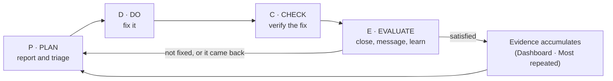

| Phase | Question it answers | Owner | Exit condition |
|---|---|---|---|
| **P · Plan** | What is the problem, and how bad is it? | Reporter + Admin | Issue exists, `status = pending`, priority set |
| **D · Do** | Is someone fixing it? | Admin | `status = fixing` |
| **C · Check** | Was the fix actually made? | Admin | `status = done`, `completed_at` set |
| **E · Evaluate** | Is the reporter satisfied, and did we learn? | Admin + Reporter | Message read; stays done or reopens |

---

## 1. The whole loop, end to end

A single diagram with the three actors as lanes: the **reporter**, the **admin**,
and the **database/app** that enforces the rules between them.

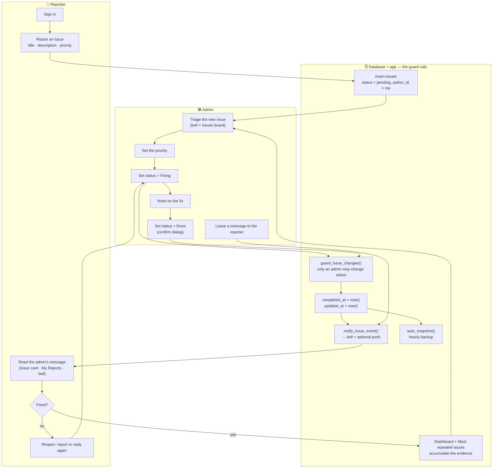

---

## 2. Phase 1 — PLAN (report and triage)

**Goal:** turn a complaint into a trackable issue with a priority.

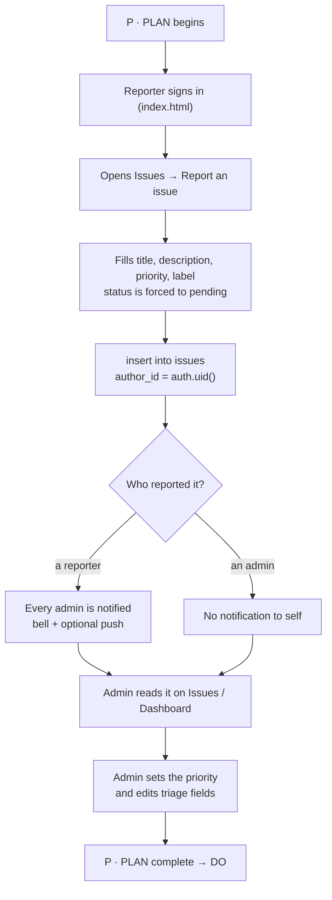

- The reporter **cannot choose a status**; the DB policy only accepts
  `status = pending` for a non-admin.
- Priority (`low · medium · high`) is how the admin sizes the work.

---

## 3. Phase 2 — DO (make the fix)

**Goal:** move the issue into work and actually fix it.

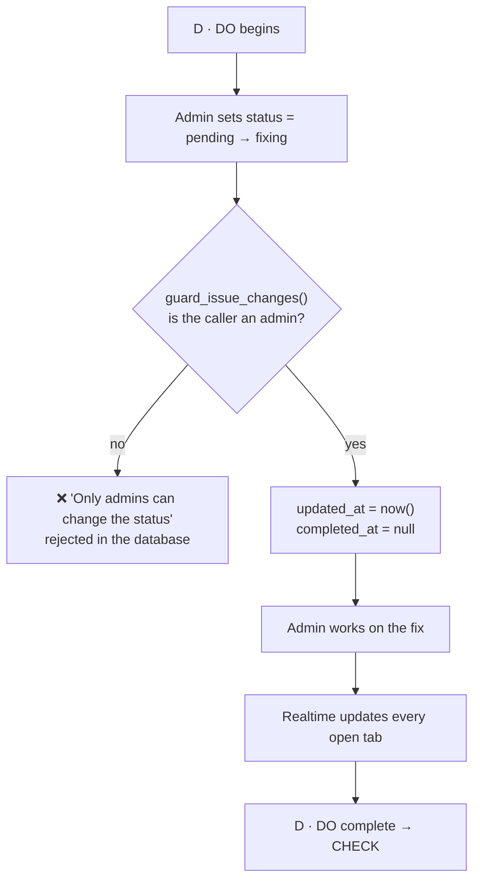

> This is the rule that shapes the whole app: RLS decides *which rows* you may
> update, and the `guard_issue_changes()` trigger decides *which columns*. Even a
> hand-crafted API call is refused.

---

## 4. Phase 3 — CHECK (verify it is really done)

**Goal:** confirm the fix before closing, and record when it was closed.

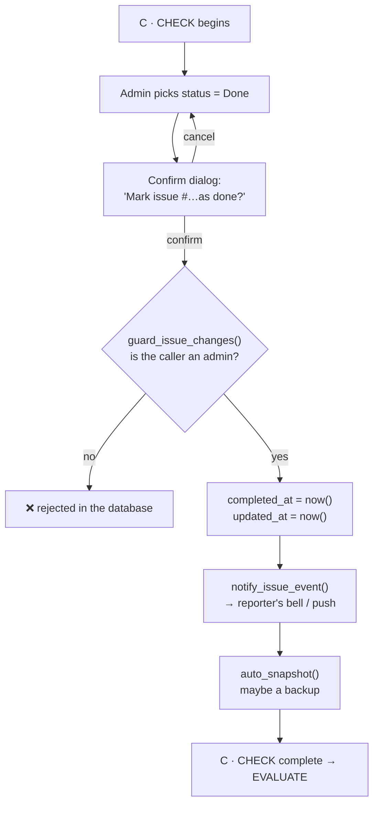

- The confirm dialog lives on the Issues board (and the legacy `admin-*` pages)
  and cannot be bypassed by the reporter.
- `completed_at` is set **server-side**; the browser never sends it.

---

## 5. Phase 4 — EVALUATE (close the loop)

**Goal:** tell the reporter, confirm they are happy, and feed the evidence back.

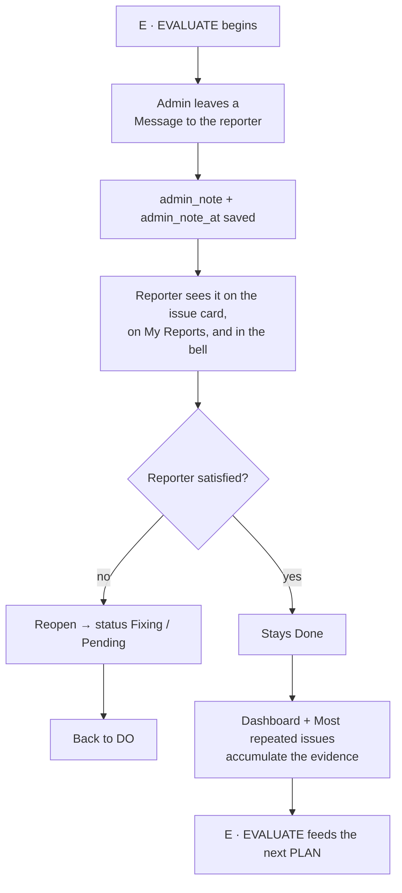

- A **repeated title** (`Login fails!` = `login-fails`) is the signal that the
  loop did not really close, and pushes the team back to PLAN.

---

## 6. The decision tree in one view

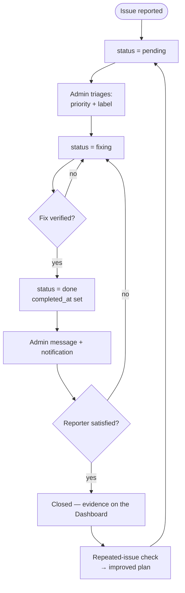

---

## 7. Where each phase lives

| Phase | Who | In the app | In the database |
|---|---|---|---|
| **P · Plan** | Reporter | `pages/issues.html` → report form | `insert into issues`, `status = 'pending'` |
| **D · Do** | Admin | Status dropdown → **Fixing** | `update status` — RLS + `guard_issue_changes()` allow admins only |
| **C · Check** | Admin | Confirm dialog before **Done** | `guard_issue_changes()` sets `completed_at` |
| **E · Evaluate** | Admin + Reporter | **Message to the reporter**; **My Reports**; notification bell | `admin_note`; `notify_issue_event()` tells the reporter |

---

## 8. The same PDCE cycle for the maintainer

The framework is not only for issues — it is how the codebase is maintained.

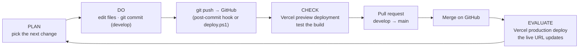

---

## 9. Where GitHub is used in the system

**GitHub is not in the runtime path.** The live app never calls GitHub: the
browser loads files from **Vercel** and talks only to **Supabase** for auth and
data. GitHub matters at **delivery time** — it is the source of truth, the review
point, and the trigger that makes Vercel build and deploy.

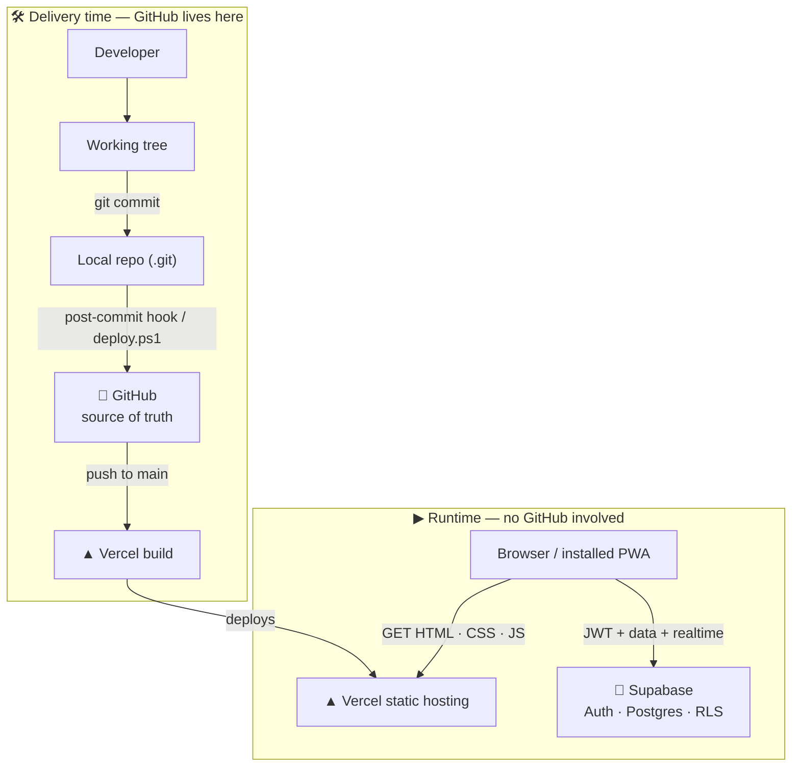

### 9.1 The jobs GitHub does

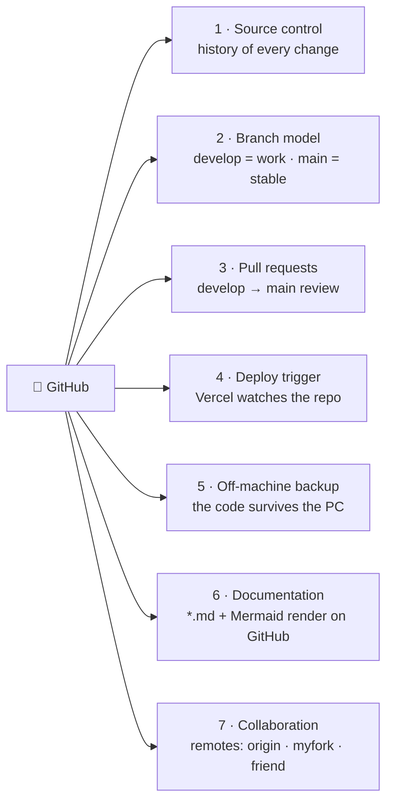

### 9.2 How a change reaches production

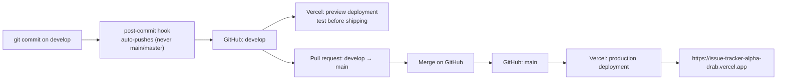

### 9.3 What each piece is for

| Touchpoint | How it is used in this project |
|---|---|
| **Source control** | Every change is a commit with history; `git log` is the audit trail of the code |
| **Branches** | Work on **`develop`**; **`main`** is the stable, deployed branch |
| **Pull requests** | `develop → main` is the review/merge gate before production |
| **Deploy trigger** | Vercel's Git integration builds on push — `main` → production, other branches → previews |
| **Auto-push** | `.git/hooks/post-commit` pushes the current branch after a commit (skips `main`/`master` on purpose); `deploy.ps1` commits + pushes in one command |
| **VS Code sync** | `.vscode/settings.json` autofetches every 60s and syncs (pull + push) after a commit |
| **Backup** | GitHub is a second, off-machine copy of the code (the data lives in Supabase, not GitHub) |
| **Docs** | `README.md`, `ARCHITECTURE.md`, `HANDOVER.md`, `PROCESS-FLOW.md` and their Mermaid diagrams render on GitHub |
| **Remotes** | `origin` = your repo, `myfork` = a fork, `friend` = someone else's — the hook refuses to auto-push a branch tracking a non-origin remote |

### 9.4 Where GitHub is not used

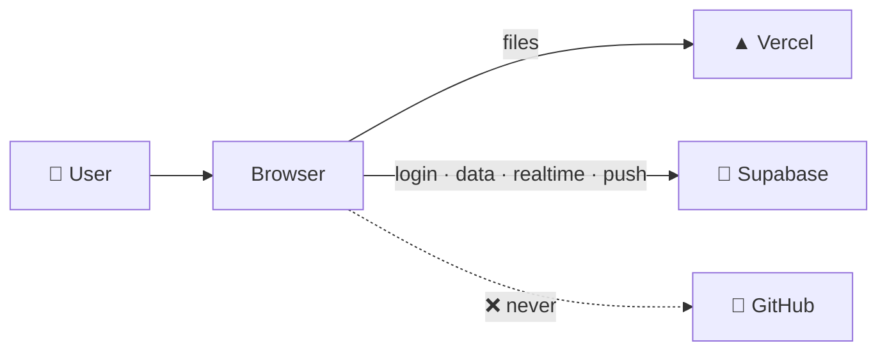

- **Authentication** — Supabase Auth, not GitHub login.
- **Data / database** — Supabase Postgres only.
- **API** — PostgREST + RPC, not GitHub.
- **Runtime secrets** — the `anon` key lives in `supabase-config.js`; GitHub is not queried at runtime.

> The `service_role` key must never be committed to GitHub. Only the public
> `anon` key belongs in the repo.

---

## 10. Golden rules of the loop

1. **One row per problem.** Every phase writes to the same `issues` row.
2. **Only an admin moves the status.** Enforced by the database, not the UI.
3. **Nothing is destroyed.** Deleting is a soft delete into the Archive.
4. **Every close is announced.** `notify_issue_event()` tells the reporter.
5. **Every loop leaves evidence.** The Dashboard and *Most repeated issues* feed
   the next PLAN.
